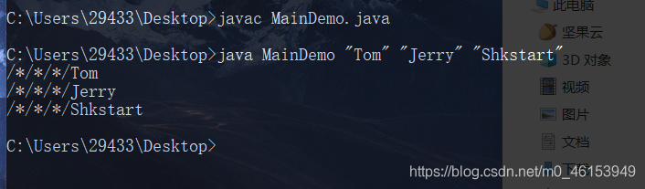

由于 Java 虚拟机需要调用类的 main()方法，所以该方法的访问权限必须是 public，又因为 Java 虚拟机在执行 main()方法时不必创建对象，所以该方法必须是 static 的，该方法接收一个 String 类型的数组参数，该数组中保存执行 Java 命令时传递给所运行的类的参数。

又因为 main() 方法是静态的，我们不能直接访问该类中的非静态成员，必须创建该类的一个实例对象后，才能通过这个对象去访问类中的非静态成员，这种情况，我们在之前的例子中多次碰到。

```java
/*
 * main()方法的使用说明
 * 1.main()方法作为程序的入口;
 * 2.main()方法也是一个普通的静态方法
 * 3.main()方法也可以作为我们与控制台交互的方式。(之前，使用 Scanner)
 * 
 * 
 */
public class MainTest { 
  public static void main(String[] args) {   //入口

    Main.main(new String[100]);

    MainTest test = new MainTest();
    test.show();
  }

  public void show(){ 

  }
}

class Main{ 
  public static void main(String[] args) { 
    args = new String[100];
    for(int i = 0;i < args.length;i++){ 
      args[i] = "args_" + i;
      System.out.println(args[i]);
    }
  }
}
```

> **命令行参数用法举例**

```java
public class MainDemo { 
  public static void main(String[] args) { 

    for(int i = 0;i < args.length;i++){ 
      System.out.println("/*/*/*/"+ args[i]);
    }
  }
}
```

> //运行程序 MainDemo.java

```java
javac MainDemo.java
java MainDemo “Tom” “Jerry” “Shkstart”
```


