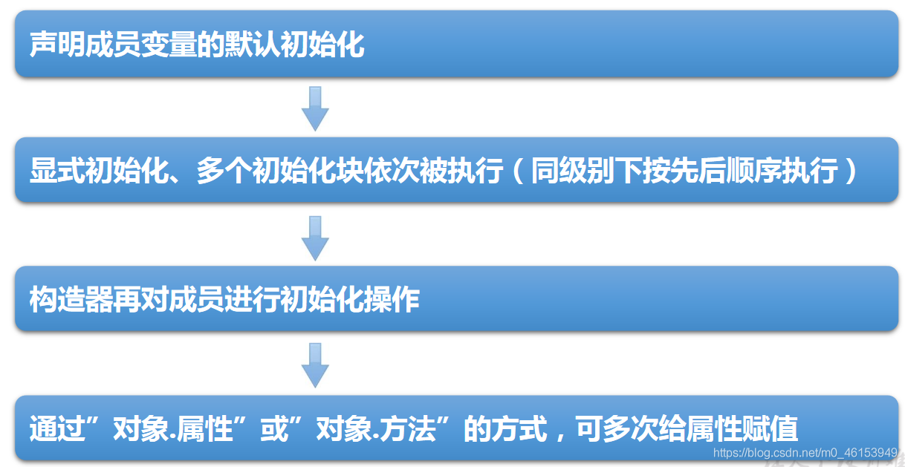

```java
/*
 * 类的成员之四:代码块（或初始化块）
 * 
 * 1.代码块的作用：用来初始化类、对象的
 * 2.代码块如果有修饰的话，只能使用 static
 * 3.分类:静态代码块 vs 非静态代码块
 * 
 * 4.静态代码块
 *   》内部可以有输出语句
 *  》随着类的加载而执行,而且只执行一次
 *  》作用:初始化类的信息
 *  》如果一个类中，定义了多个静态代码块，则按照声明的先后顺序执行
 *  》静态代码块的执行，优先于非静态代码块的执行
 *  》静态代码块内只能调用静态的属性、静态的方法，不能调用非静态的结构
 * 
 * 5.非静态代码块
 *  >内部可以有输出语句
 *  >随着对象的创建而执行
 *  >每创建一个对象，就执行一次非静态代码块。
 *  >作用:可以在创建对象时，对对象的属性等进行初始化。
 *  >如果一个类中，定义了多个非静态代码块，则按照声明的先后顺序执行
 *  >非静态代码块内可以调用静态的属性、静态的方法，或非静态的属性、非静态的方法。
 *  
 * 对属性可以赋值的位置:
 *  ①默认初始化
 *  ②显式初始化
 *  ③构造器中初始化
 *  ④有了对象以后，可以通过"对象.属性"或"对象.方法"的方式，进行赋值。
 *  ⑤在代码块中赋值
 */
public class BlockTest { 
  public static void main(String[] args) { 

    String desc = Person.desc;
    System.out.println(desc);

    Person p1 = new Person();
    Person p2 = new Person();
    System.out.println(p1.age);

    Person.info();
  }
}

class Person{ 
  //属性
  String name;
  int age;
  static String desc = "我是一个青年";

  //构造器
  public Person(){ 

  }

  //static 的代码块
  static{ 
    System.out.println("hello,static block-1");
    //调用静态结构
    desc = "我是一个爱小说的人";
    info();
    //不能调用非静态结构
//    eat();
//    name = "Tom";
  }

  static{ 
    System.out.println("hello,static block-2");
  }

  //非 static 的代码块
  { 
    System.out.println("hello,block-2");
  }
  { 
    System.out.println("hello,block-1");
    //调用非静态结构
    age = 1;
    eat();
    //调用静态结构
    desc = "我是一个爱小说的人 1";
    info();
  }

  //方法
  public Person(String name,int age){ 
    this.name = name;
    this.age = age;
  }

  public void eat(){ 
    System.out.println("吃饭");
  }

  @Override
  public String toString() { 
    return "Person [name=" + name + ", age=" + age + "]";
  }
  public static void info(){ 
    System.out.println("我是一个快乐的人。");
  }

}
```

> **静态初始化块举例 1**

```java
//总结:由父类到子类，静态先行
class Root{ 
  static{ 
    System.out.println("Root 的静态初始化块");
  }
  { 
    System.out.println("Root 的普通初始化块");
  }
  public Root(){ 
    System.out.println("Root 的无参数的构造器");
  }
}
class Mid extends Root{ 
  static{ 
    System.out.println("Mid 的静态初始化块");
  }
  { 
    System.out.println("Mid 的普通初始化块");
  }
  public Mid(){ 
    System.out.println("Mid 的无参数的构造器");
  }
  public Mid(String msg){ 
    //通过 this 调用同一类中重载的构造器
    this();
    System.out.println("Mid 的带参数构造器，其参数值："
      + msg);
  }
}
class Leaf extends Mid{ 
  static{ 
    System.out.println("Leaf 的静态初始化块");
  }
  { 
    System.out.println("Leaf 的普通初始化块");
  }
  public Leaf(){ 
    //通过 super 调用父类中有一个字符串参数的构造器
    super("尚硅谷");
    System.out.println("Leaf 的构造器");
  }
}
public class LeafTest{ 
  public static void main(String[] args){ 
    new Leaf(); 
    //new Leaf();
  }
}
```

> **静态初始化块举例 2**

```java
class Father { 
  static { 
    System.out.println("11111111111");
  }
  { 
    System.out.println("22222222222");
  }

  public Father() { 
    System.out.println("33333333333");

  }

}

public class Son extends Father { 
  static { 
    System.out.println("44444444444");
  }
  { 
    System.out.println("55555555555");
  }
  public Son() { 
    System.out.println("66666666666");
  }

  public static void main(String[] args) {  // 由父及子 静态先行
    System.out.println("77777777777");
    System.out.println("************************");
    new Son();
    System.out.println("************************");

    new Son();
    System.out.println("************************");
    new Father();
  }

}
```

> **总结：程序中成员变量赋值的执行顺序**

如果有父类，就先对父类进行初始化



```java
/*
 * 对属性可以赋值的位置:
 *  ①默认初始化
 *  ②显式初始化 / ⑤在代码块中赋值
 *  ③构造器中初始化
 *  ④有了对象以后，可以通过"对象.属性"或"对象.方法"的方式，进行赋值。
 *  
 *  执行的先后顺序:① - ② / ⑤ - ③ - ④
 */
public class OrderTest { 
  public static void main(String[] args) { 
    Order order = new Order();
    System.out.println(order.orderId);
  }
}
class Order{ 

  int orderId = 3;
  { 
    orderId = 4;
  }

}
```