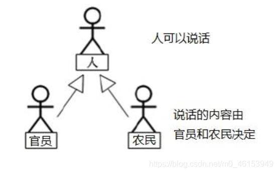
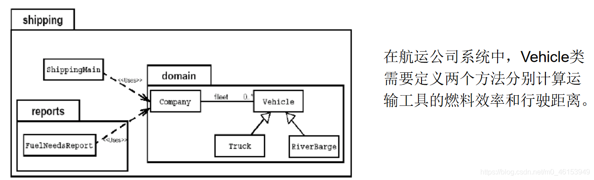
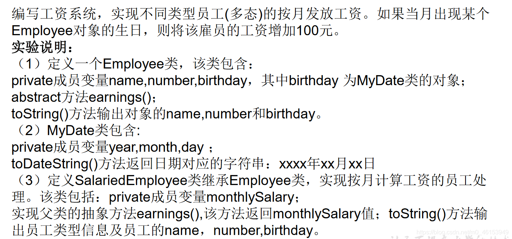
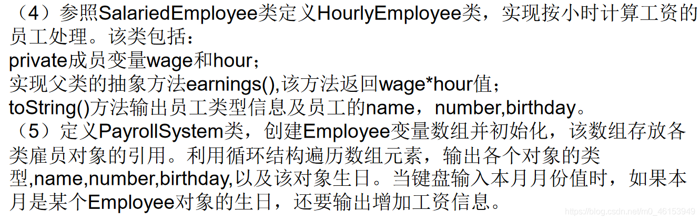

随着继承层次中一个个新[子类](https://so.csdn.net/so/search?q=子类&spm=1001.2101.3001.7020)的定义，类变得越来越具体，而父类则更一般，更通用。类的设计应该保证父类和子类能够共享特征。有时将一个父类设计得非常抽象，以至于它没有具体的实例，这样的类叫做 **抽象类** 。




```java
 /*
 * abstract 关键字的使用
 * 
 * 1.abstract:抽象的
 * 2.abstract 可以用来修饰的结构:类、方法
 * 3.abstract 修饰类:抽象类
 *   》 此类不能实例化
 *  》 抽象类中一定有构造器，便于子类实例化时调用(涉及:子类对象实例化全过程)
 *  》 开发中，都会提供抽象类的子类，让子类对象实例化，实现相关的操作
 * 
 * 4.abstract 修饰方法:抽象方法
 *  > 抽象方法，只有方法的声明，没有方法体。
 *  > 包含抽象方法的类，一定是一个抽象类。反之，抽象类中可以没有抽象方法
 *  > 抽象类继承，如果子类也是一个抽象类，并不要求一定重写父类方法。如果子类不是抽象类，
 *   则要求子类一定要实现父类中的抽象方法
 *
 * abstract 使用上的注意点:
 * 1.abstract 不能用来修饰变量、代码块、构造器；
 * 
 * 2.abstract 不能用来修饰私有方法、静态方法、final 的方法、final 的类。
 * 
 */   
public class AbstractTest { 
  public static void main(String[] args) { 
    //一旦 Person 类抽象了，就不可实例化
//    Person p1 = new Person();
//    p1.eat();

  }
}

abstract class Creature{ 
  public abstract void breath();
}

abstract class Person extends Creature{ 
  String name;
  int age;

  public Person(){ 

  }

  public Person(String name,int age){ 
    this.name = name;
    this.age = age;
  }

  //不是抽象方法
//  public void eat(){ 
//    System.out.println("人吃饭");
//  }

  //抽象方法
  public abstract void eat();

  public void walk(){ 
    System.out.println("人走路");
  }
}

class Student extends Person{ 
  public Student(String name,int age){ 
    super(name,age);
  }
  public void eat(){ 
    System.out.println("学生应该多吃有营养的。");
  }
  @Override
  public void breath() { 
    System.out.println("学生应该呼吸新鲜的无雾霾空气");
  }
}
```

## 5.1、抽象类应用

> 抽象类是用来模型化那些父类无法确定全部实现，而是由其子类提供具体实现的对象的类。




> 问题：卡车(Truck)和驳船(RiverBarge)的燃料效率和行驶距离的计算方法完全不同。Vehicle 类不能提供计算方法，但子类可以。

```java
/* Java 允许类设计者指定：超类声明一个方法但不提供实现，该方法的实现由子类提  供。这样的方法称为抽象方法。有一个或更多抽象方法的类称为抽象类。
 * Vehicle 是一个抽象类，有两个抽象方法。
 * 注意：抽象类不能实例化 new Vihicle()是非法的
 */
public abstract class Vehicle{ 
  public abstract double calcFuelEfficiency();//计算燃料效率的抽象方法
  public abstract double calcTripDistance();//计算行驶距离的抽象方法
}
public class Truck extends Vehicle{ 
  public double calcFuelEfficiency(){  
    //写出计算卡车的燃料效率的具体方法
  }
  public double calcTripDistance(){  
    //写出计算卡车行驶距离的具体方法
  }
}
public class RiverBarge extends Vehicle{ 
  public double calcFuelEfficiency() {  
    //写出计算驳船的燃料效率的具体方法
  }
  public double calcTripDistance( )  {   
    //写出计算驳船行驶距离的具体方法
  }
}
```

## 5.2、练习

```java
/*
 * 编写一个 Employee 类，声明为抽象类，
 * 包含如下三个属性：name，id，salary。
 * 提供必要的构造器和抽象方法：work()。
 * 对于 Manager 类来说，他既是员工，还具有奖金(bonus)的属性。
 * 请使用继承的思想，设计 CommonEmployee 类和 Manager 类，
 * 要求类中提供必要的方法进行属性访问。
 * 
 */
public abstract class Employee { 

  private String name;
  private int id;
  private double salary;

  public Employee(){ 
    super();
  }

  public Employee(String name, int id, double salary) { 
    super();
    this.name = name;
    this.id = id;
    this.salary = salary;
  }

  public abstract void work();
}
```

> Manager 类

```java
/*
 * 对于 Manager 类来说，他既是员工，还具有奖金(bonus)的属性。
 * 
 */
public class Manager extends Employee{ 

  private double bonus;  //奖金

  public Manager(double bonus) { 
    super();
    this.bonus = bonus;
  }

  public Manager(String name, int id, double salary, double bonus) { 
    super(name, id, salary);
    this.bonus = bonus;
  }


  @Override
  public void work() { 
    System.out.println("管理员工，提高公司运行效率。");
  }
}
```

> CommonEmployee 类

```java
public class CommonEmployee extends Employee { 

  @Override
  public void work() { 
    System.out.println("员工在一线车间生产产品。");
  }

}
```

> 测试类

```java
/*
 * 请使用继承的思想，设计 CommonEmployee 类和 Manager 类，
 */
public class EmployeeTest { 
  public static void main(String[] args) { 

    Employee manager = new Manager("库克",1001,5000,50000);

    manager.work();

    CommonEmployee commonEmployee = new CommonEmployee();
    commonEmployee.work();
  }
}
```

## 5.3、创建抽象类的匿名子类对象

```java
public class Num { 

}

abstract class Creature{ 
  public abstract void breath();
}

abstract class Person extends Creature{ 
  String name;
  int age;

  public Person(){ 

  }

  public Person(String name,int age){ 
    this.name = name;
    this.age = age;
  }

  //不是抽象方法
//  public void eat(){ 
//    System.out.println("人吃饭");
//  }

  //抽象方法
  public abstract void eat();

  public void walk(){ 
    System.out.println("人走路");
  }
}

class Student extends Person{ 
  public Student(String name,int age){ 
    super(name,age);
  }
  public Student(){ 

  }
  public void eat(){ 
    System.out.println("学生应该多吃有营养的。");
  }
  @Override
  public void breath() { 
    System.out.println("学生应该呼吸新鲜的无雾霾空气");
  }
}
```

> PersonTest 类

```java
/*
 * 抽象类的匿名子类
 * 
 */
public class PersonTest { 
  public static void main(String[] args) { 

    method(new Student());  //匿名对象

    Worker worker = new Worker(); 
    method1(worker);  //非匿名的类非匿名的对象

    method1(new Worker());  //非匿名的类匿名的对象

    System.out.println("*********************");

    //创建了一个匿名子类的对象:p
    Person p = new Person(){ 

      @Override
      public void eat() { 
        System.out.println("吃东西");
      }

      @Override
      public void breath() { 
        System.out.println("呼吸空气");
      }
  
    };
    method1(p);
    System.out.println("**********************"); 
    //创建匿名子类的匿名对象
    method1(new Person(){ 

      @Override
      public void eat() { 
        System.out.println("吃零食");
      }

      @Override
      public void breath() { 
        System.out.println("云南的空气");
      }
  
    });
  }

  public static void method1(Person p){ 
    p.eat();
    p.walk();
  }

  public static void method(Student s){ 

  }
}
class Worker extends Person{ 

  @Override
  public void eat() { 
  }

  @Override
  public void breath() { 
  }
}
```

## 5.4、[多态](https://so.csdn.net/so/search?q=多态&spm=1001.2101.3001.7020)的应用：模板方法设计模式(TemplateMethod)

抽象类体现的就是一种模板模式的设计，抽象类作为多个子类的通用模板，子类在抽象类的基础上进行扩展、改造，但子类总体上会保留抽象类的行为方式。

> 解决的问题：

当功能内部一部分实现是确定的，一部分实现是不确定的。这时可以把不确定的部分暴露出去，让子类去实现。 换句话说，**在软件开发中实现一个算法时，整体步骤很固定、通用，这些步骤已经在父类中写好了。但是某些部分易变，易变部分可以抽象出来，供不同子类实现。这就是一种模板模式。**

> 1、例 1

```java
/*
 * 抽象类的应用:模板方法的设计模式
 */
public class TemplateTest { 
  public static void main(String[] args) { 

    SubTemlate t = new SubTemlate();

    t.sendTime();
  }
}
abstract class Template{ 

  //计算某段代码执行所需花费的时间
  public void sendTime(){ 

    long start = System.currentTimeMillis();

    code();  //不确定部分，易变的部分

    long end = System.currentTimeMillis();

    System.out.println("花费的时间为:" + (end - start));
  }

  public abstract void code();
}

class SubTemlate extends Template{ 

  @Override
  public void code() { 

    for(int i = 2;i <= 1000;i++){ 
      boolean isFlag = true;
      for(int j = 2;j <= Math.sqrt(i);j++){ 
        if(i % j == 0){ 
          isFlag = false;
          break;
        }
      }
      if(isFlag){ 
        System.out.println(i);
      }
    }
  }
}
```

> 2、例 2

```java
//抽象类的应用：模板方法的设计模式
public class TemplateMethodTest { 

  public static void main(String[] args) { 
    BankTemplateMethod btm = new DrawMoney();
    btm.process();

    BankTemplateMethod btm2 = new ManageMoney();
    btm2.process();
  }
}
abstract class BankTemplateMethod { 
  // 具体方法
  public void takeNumber() { 
    System.out.println("取号排队");
  }

  public abstract void transact(); // 办理具体的业务 //钩子方法

  public void evaluate() { 
    System.out.println("反馈评分");
  }

  // 模板方法，把基本操作组合到一起，子类一般不能重写
  public final void process() { 
    this.takeNumber();

    this.transact();// 像个钩子，具体执行时，挂哪个子类，就执行哪个子类的实现代码

    this.evaluate();
  }
}

class DrawMoney extends BankTemplateMethod { 
  public void transact() { 
    System.out.println("我要取款！！！");
  }
}

class ManageMoney extends BankTemplateMethod { 
  public void transact() { 
    System.out.println("我要理财！我这里有 2000 万美元!!");
  }
}
```

> 模板方法设计模式是编程中经常用得到的模式。各个框架、类库中都有他的影子，比如常见的有：

- 数据库访问的封装
- Junit 单元测试
- JavaWeb 的 Servlet 中关于 doGet/doPost 方法调用
- Hibernate 中模板程序
- Spring 中 JDBCTemlate、HibernateTemplate 等

## 5.5、抽象类的练习





> 1、Employee 类

```java
/*
 * 定义一个 Employee 类，
 * 该类包含：private 成员变量 name,number,birthday，
 * 其中 birthday 为 MyDate 类的对象；
 * abstract 方法 earnings()；
 * toString()方法输出对象的 name,number 和 birthday。
 * 
 */
public abstract class Employee { 
  private String name;
  private int number;
  private MyDate birthday;

  public Employee(String name, int number, MyDate birthday) { 
    super();
    this.name = name;
    this.number = number;
    this.birthday = birthday;
  }

  public String getName() { 
    return name;
  }

  public void setName(String name) { 
    this.name = name;
  }

  public int getNumber() { 
    return number;
  }

  public void setNumber(int number) { 
    this.number = number;
  }

  public MyDate getBirthday() { 
    return birthday;
  }

  public void setBirthday(MyDate birthday) { 
    this.birthday = birthday;
  }

  public abstract double earnings();

  @Override
  public String toString() { 
    return "name=" + name + ", number=" + number + ", birthday=" + birthday.toDateString() + "]";
  }

}
```

> 2、MyDate 类

```java
/*
 * MyDate 类包含:private 成员变量 year,month,day；
 * toDateString()方法返回日期对应的字符串：xxxx 年 xx 月 xx 日
 */
public class MyDate { 
  private int year;
  private int month;
  private int day;

  public MyDate(int year, int month, int day) { 
    super();
    this.year = year;
    this.month = month;
    this.day = day;
  }

  public int getYear() { 
    return year;
  }

  public void setYear(int year) { 
    this.year = year;
  }

  public int getMonth() { 
    return month;
  }

  public void setMonth(int month) { 
    this.month = month;
  }

  public int getDay() { 
    return day;
  }

  public void setDay(int day) { 
    this.day = day;
  }

  public String toDateString(){ 
    return year + "年" + month + "月" + day + "日";
  }
}
```

> 3、SalariedEmployee 类

```java
/*
 * 定义 SalariedEmployee 类继承 Employee 类，实现按月计算工资的员工处理。
 * 该类包括：private 成员变量 monthlySalary；实现父类的抽象方法 earnings(),
 * 该方法返回 monthlySalary 值；
 * toString()方法输出员工类型信息及员工的 name，number,birthday。
 * 
 */
public class SalariedEmployee extends Employee{ 
  private double monthlySalary;  //月工资

  public SalariedEmployee(String name,int number,MyDate birthday) { 
    super(name,number,birthday);
  }

  public SalariedEmployee(String name, int number, MyDate birthday, double monthlySalary) { 
    super(name, number, birthday);
    this.monthlySalary = monthlySalary;
  }

  @Override
  public double earnings() { 
    return monthlySalary;
  }

  @Override
  public String toString() { 
    return "SalariedEmployee [" + super.toString() + "]";
  }
}
```

> 4、HourlyEmployee 类

```java
/*
 * 参照 SalariedEmployee 类定义 HourlyEmployee 类，
 * 实现按小时计算工资的员工处理。该类包括：private 成员变量 wage 和 hour；
 * 实现父类的抽象方法 earnings(),该方法返回 wage*hour 值；
 * toString()方法输出员工类型信息及员工的 name，number,birthday。
 * 
 */
public class HourlyEmployee extends Employee{ 
  private int wage;  //每小时的工资
  private int hour;  //月工作的小时数

  public HourlyEmployee(String name, int number, MyDate birthday) { 
    super(name, number, birthday);
  }

  public HourlyEmployee(String name, int number, MyDate birthday, int wage, int hour) { 
    super(name, number, birthday);
    this.wage = wage;
    this.hour = hour;
  }

  @Override
  public double earnings() { 
    return wage*hour;
  }

  public int getWage() { 
    return wage;
  }

  public void setWage(int wage) { 
    this.wage = wage;
  }

  public int getHour() { 
    return hour;
  }

  public void setHour(int hour) { 
    this.hour = hour;
  }

  public String toString(){ 
    return "HourlyEmployee[" + super.toString() + "]"; 
  }
}
```

> 5、PayrollSystem 类

```java
import java.util.Calendar;
import java.util.Scanner;
/*
 * 定义 PayrollSystem 类，创建 Employee 变量数组并初始化，
 * 该数组存放各类雇员对象的引用。利用循环结构遍历数组元素，
 * 输出各个对象的类型,name,number,birthday,以及该对象生日。
 * 当键盘输入本月月份值时，
 * 如果本月是某个 Employee 对象的生日，还要输出增加工资信息。
 * 
 */
public class PayrollSystem { 
  public static void main(String[] args) { 
    //方式一：
//    Scanner scanner = new Scanner(System.in);
//    System.out.println("请输入当月的月份：");
//    int month = scanner.nextInt();

    //方式二：
    Calendar calendar = Calendar.getInstance();
    int month = calendar.get(Calendar.MONTH);//获取当前的月份
//    System.out.println(month);//一月份：0

    Employee[] emps = new Employee[2];

    emps[0] = new SalariedEmployee("马良", 1002,new MyDate(1992, 2, 28),10000);
    emps[1] = new HourlyEmployee("博西", 2001, new MyDate(1991, 1, 6),60,240);

    for(int i = 0;i < emps.length;i++){ 
      System.out.println(emps[i]);
      double salary = emps[i].earnings();
      System.out.println("月工资为：" + salary);
  
      if((month+1) == emps[i].getBirthday().getMonth()){ 
        System.out.println("生日快乐！奖励 100 元");
      }
  
    }
  }
}
```