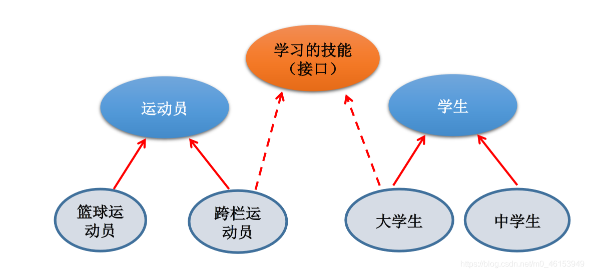
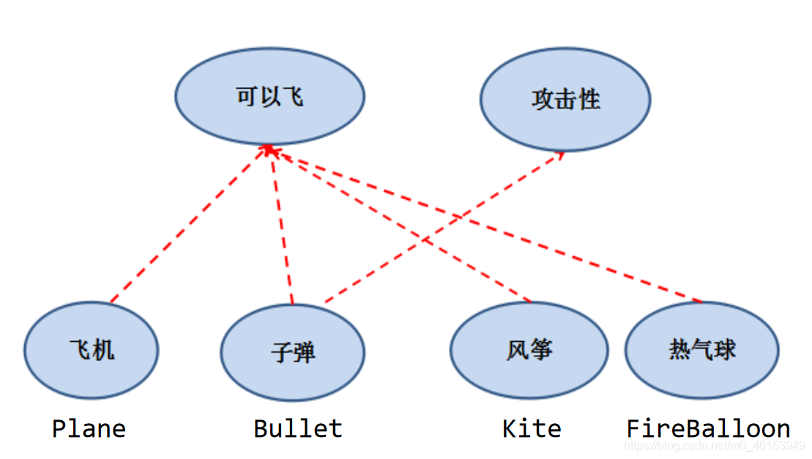
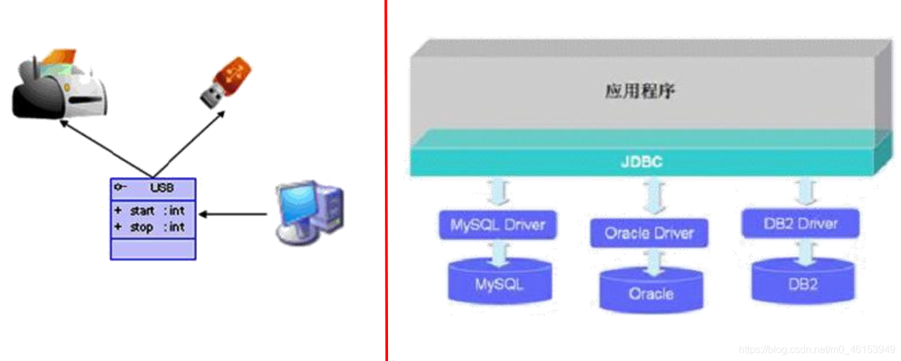
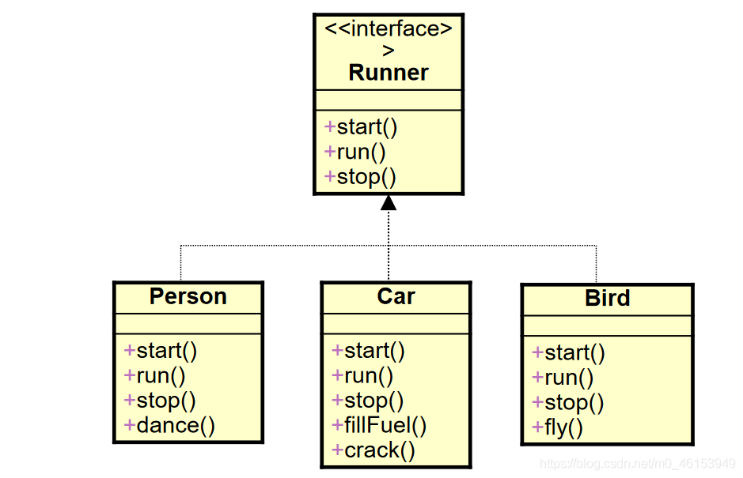
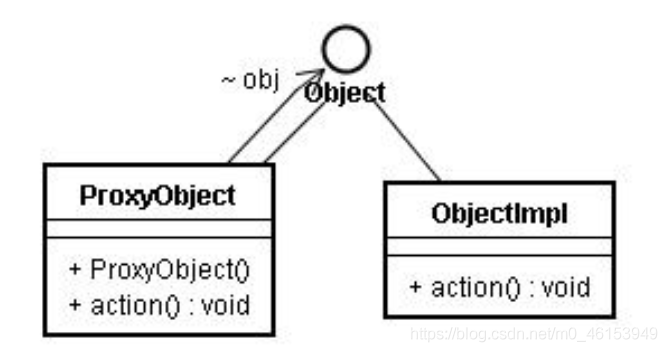

## 6.1、概述

一方面，有时必须从几个类中派生出一个子类，继承它们所有的属性和方法。但是，Java 不支持多重继承。有了接口，就可以得到多重继承的效果。

另一方面，有时必须从几个类中抽取出一些共同的行为特征，而它们之间又没有 is-a 的关系，仅仅是具有相同的行为特征而已。例如：鼠标、键盘、打印机、扫描仪、摄像头、充电器、MP3 机、手机、数码相机、移动硬盘等都支持 USB 连接。

接口就是规范，定义的是一组规则，体现了现实世界中“如果你是/要…则必须能…”的思想。**继承是一个"是不是"的关系，而接口实现则是"能不能"的关系。**

**接口的本质是契约，标准，规范** ，就像我们的法律一样。制定好后大家都要遵守。




```java
/* 接口(interface)是抽象方法和常量值定义的集合。
 * 接口的特点：
 * 用 interface 来定义。
 * 接口中的所有成员变量都默认是由 public static final 修饰的。
 * 接口中的所有抽象方法都默认是由 public abstract 修饰的。
 * 接口中没有构造器。
 * 接口采用多继承机制。
 */
```




```java
/*
 * 接口的使用
 * 1.接口使用 interface 来定义。
 * 2.在 Java 中:接口和类是并列的两个结构
 * 3.如何去定义两个接口:定义接口中的成员
 *   》3.1 JDK7 及以前:只能定义全局常量和抽象方法
 *     》全局常量:public static final 的,但是书写中，可以省略不写。
 *     》抽象方法:public abstract 的
 * 
 *  》3.2 JDK8:除了全局常量和抽象方法之外，还可以定义静态方法、默认方法(略)。
 * 
 * 4.接口中不能定义构造器！意味着接口不可以实例化。
 * 
 * 5.Java 开发中，接口通过让类去实现(implements)的方式来使用。
 *   如果实现类覆盖了接口中的所有方法，则此实现类就可以实例化
 *   如果实现类没有覆盖接口中所有的抽象方法，则此实现类仍为一个抽象类
 * 
 * 6.Java 类可以实现多个接口 ---》弥补了 Java 单继承性的局限性
 *  格式:class AA extends BB implementd CC,DD,EE
 *  
 *  7.接口与接口之间是继承,而且可以多继承
 *  
 **********************************
 * 8.接口的具体使用，体现多态性
 *      接口的主要用途就是被实现类实现。（面向接口编程）
 * 9.接口，实际可以看作是一种规范
 * 
 * 面试题:抽象类与接口有哪些异同？
 *  
 */
public class InterfaceTest { 
  public static void main(String[] args) { 
    System.out.println(Flayable.MAX_SPEED);
    System.out.println(Flayable.MIN_SPEED);
  }
}
interface Flayable{ 

  //全局变量
  public static final int MAX_SPEED = 7900;
  int MIN_SPEED = 1;//省略了 public static final 

  //抽象方法
  public abstract void fly();
  //抽象方法
  void stop();//省略了 public abstract 
  //Interfaces cannot have constructors
//  public Flayable(){ 
//
//  }
}
interface Attackable{ 
  void attack();
}

class Plane implements Flayable{ 

  @Override
  public void fly() { 
    System.out.println("飞机通过引擎起飞");

  }

  @Override
  public void stop() { 
    System.out.println("驾驶员减速停止");
  }

}
abstract class Kite implements Flayable{ 

  @Override
  public void fly() { 

  }
}

class Bullet extends Object implements Flayable,Attackable,CC{ 

  @Override
  public void attack() { 
    // TODO Auto-generated method stub

  }

  @Override
  public void fly() { 
    // TODO Auto-generated method stub

  }

  @Override
  public void stop() { 
    // TODO Auto-generated method stub

  }

  @Override
  public void method1() { 
    // TODO Auto-generated method stub

  }

  @Override
  public void method2() { 
    // TODO Auto-generated method stub

  }
}

//*********************************
interface AA{ 
  void method1();
}
interface BB{ 
  void method2();
}
interface CC extends AA,BB{ 

}
```





## 6.2、举例

```java
/*
 * 接口的使用
 * 1.接口使用上也满足多态性
 * 2.接口，实际上就是定义了一种规范
 * 3.开发中，体会面向接口编程！
 * 
 */
public class USBTest { 
  public static void main(String[] args) { 

    Computer com = new Computer();
    //1.创建了接口的非匿名实现类的非匿名对象
    Flash flash = new Flash();
    com.transferData(flash); 
    //2. 创建了接口的非匿名实现类的匿名对象
    com.transferData(new Printer());
    //3. 创建了接口的匿名实现类的非匿名对象
    USB phone = new USB(){ 

      @Override
      public void start() { 
        System.out.println("手机开始工作");
      }

      @Override
      public void stop() { 
        System.out.println("手机结束工作");
      }

    };
    com.transferData(phone);
    //4. 创建了接口的匿名实现类的匿名对象
    com.transferData(new USB(){ 
      @Override
      public void start() { 
        System.out.println("mp3 开始工作");
      }

      @Override
      public void stop() { 
        System.out.println("mp3 结束工作");
      }
    });
  }
}

class Computer{ 

  public void transferData(USB usb){ //USB usb = new Flash();
    usb.start();

    System.out.println("具体传输数据的细节");

    usb.stop();
  }

}

interface USB{ 
  //常量:定义了长、宽
  void start();

  void stop();
}
class Flash implements USB{ 

  @Override
  public void start() { 
    System.out.println("U 盘开始工作");
  }

  @Override
  public void stop() { 
    System.out.println("U 盘结束工作");
  }
}
class Printer implements USB{ 
  @Override
  public void start() { 
    System.out.println("打印机开启工作");
  }

  @Override
  public void stop() { 
    System.out.println("打印机结束工作");
  }

}
```

## 6.3、接口的应用：代理模式(Proxy)

代理模式是 Java 开发中使用较多的一种设计模式。代理设计就是为其他对象提供一种代理以控制对这个对象的访问。




```java
/*
 * 接口的应用:代理模式
 * 
 * 
 */
public class NetWorkTest { 
  public static void main(String[] args) { 

    Server server = new Server();
//    server.browse();
    ProxyServer proxyServer = new ProxyServer(server);

    proxyServer.browse();
  }
}
interface NetWork{ 
  public void browse();

}
//被代理类
class Server implements NetWork{ 


  @Override
  public void browse() { 
    System.out.println("真实的服务器来访问网络");
  }
}
//代理类
class ProxyServer implements NetWork{ 

  private NetWork work;

  public ProxyServer(NetWork work){ 
    this.work = work;
  }

  public void check(){ 
    System.out.println("联网前的检查工作");
  }

  @Override
  public void browse() { 
    check();

    work.browse();
  }

}
```

> 应用场景：

- 安全代理：屏蔽对真实角色的直接访问。
- 远程代理：通过代理类处理远程方法调用（RMI）
- 延迟加载：先加载轻量级的代理对象，真正需要再加载真实对象

比如你要开发一个大文档查看软件，大文档中有大的图片，有可能一个图片有 100MB，在打开文件时，不可能将所有的图片都显示出来，这样就可以使用代理模式，当需要查看图片时，用 proxy 来进行大图片的打开。

> 分类

- 静态代理（静态定义代理类）
- 动态代理（动态生成代理类）
  - JDK 自带的动态代理，需要反射等知识

```java
public class StaticProxyTest { 

  public static void main(String[] args) { 
    Proxy s = new Proxy(new RealStar());
    s.confer();
    s.signContract();
    s.bookTicket();
    s.sing();
    s.collectMoney();
  }
}

interface Star { 
  void confer();// 面谈

  void signContract();// 签合同

  void bookTicket();// 订票

  void sing();// 唱歌

  void collectMoney();// 收钱
}
//被代理类
class RealStar implements Star { 

  public void confer() { 
  }

  public void signContract() { 
  }

  public void bookTicket() { 
  }

  public void sing() { 
    System.out.println("明星：歌唱~~~");
  }

  public void collectMoney() { 
  }
}

//代理类
class Proxy implements Star { 
  private Star real;

  public Proxy(Star real) { 
    this.real = real;
  }

  public void confer() { 
    System.out.println("经纪人面谈");
  }

  public void signContract() { 
    System.out.println("经纪人签合同");
  }

  public void bookTicket() { 
    System.out.println("经纪人订票");
  }

  public void sing() { 
    real.sing();
  }

  public void collectMoney() { 
    System.out.println("经纪人收钱");
  }
}
```

## 6.4、接口的应用：工厂模式

拓展：[工厂设计模式.pdf](https://www.yuque.com/nizhegechouloudetuboshu/library/mlenxx)

> 接口和抽象类之间的对比

| No.  | 区别点       | 抽象类                                                       | 接口                                        |
| ---- | ------------ | ------------------------------------------------------------ | ------------------------------------------- |
| 1    | 定义         | 包含抽象方法的类                                             | 主要是抽象方法和全局常量的集合              |
| 2    | 组成         | 构造方法、抽象方法、普通方法、常量、变量                     | 常量、抽象方法、(jdk8.0:默认方法、静态方法) |
| 3    | 使用         | 子类继承抽象类(extends)                                      | 子类实现接口(implements)                    |
| 4    | 关系         | 抽象类可以实现多个接口                                       | 接口不能继承抽象类，但允许继承多个接口      |
| 5    | 常见设计模式 | 模板方法                                                     | 简单工厂、工厂方法、代理模式                |
| 6    | 对象         | 都通过对象的多态性产生实例化对象                             |                                             |
| 7    | 局限         | 抽象类有单继承的局限                                         | 接口没有此局限                              |
| 8    | 实际         | 作为一个模板                                                 | 是作为一个标准或是表示一种能力              |
| 9    | 选择         | 如果抽象类和接口都可以使用的话，优先使用接口，因为避免单继承的局限 |                                             |

> 在开发中，常看到一个类不是去继承一个已经实现好的类，而是要么继承抽象类，要么实现接口。 -【面试题】排错：

```java
interface A { 
  int x = 0;
}
class B { 
  int x = 1;
}
class C extends B implements A { 
  public void pX() { 
//    编译不通过，x 不明确
    System.out.println(x);
//    System.out.println(super.x); //1
//    System.out.println(A.x);//0
  }
  public static void main(String[] args) { 
    new C().pX();
  }
}
```

> 排错 2：

```java
interface Playable { 
  void play();
}
interface Bounceable { 
  void play();
}
interface Rollable extends Playable, Bounceable { 
  Ball ball= new Ball("PingPang"); //省略了 public static final
}
public class Ball implements Rollable { 
  private String name;
  public String getName() { 
    return name;
  }
  public Ball(String name) { 
    this.name= name;
  }
  public void play() { 
    ball = new Ball("Football"); //The final field Rollable.ball cannot be assigned
    System.out.println(ball.getName());
  }
}
```

> 练习


CompareObject 类

```java
/*
 * 定义一个接口用来实现两个对象的比较。
 * 
 */
public interface CompareObject { 
  public int compareTo(Object o);
  //若返回值是 0,代表相等;若为正数，代表当前对象大；负数代表当前对象小

}
```

Circle 类

```java
/*
 * 定义一个 Circle 类，声明 redius 属性，提供 getter 和 setter 方法
 */
public class Circle { 

  private Double radius;

  public Double getRadius() { 
    return radius;
  }

  public void setRadius(Double radius) { 
    this.radius = radius;
  }

  public Circle() { 
    super();
  }

  public Circle(Double radius) { 
    super();
    this.radius = radius;
  }

}
```

ComparableCircle 类

```java
/*
 * 定义一个 ComparableCircle 类，继承 Circle 类并且实现 CompareObject 接口。在 ComparableCircle 类中给出接口中方法 compareTo 的实现体，
 * 用来比较两个圆的半径大小。
 */
public class ComparableCircle extends Circle implements CompareObject{ 

  public ComparableCircle(double radius) { 
    super(radius);
  }
  @Override
  public int compareTo(Object o) { 
    if(this == o){ 
      return 0;
    }
    if(o instanceof ComparableCircle){ 
      ComparableCircle c = (ComparableCircle)o;
      //错误的写法
//      return (int)(this.getRedius() - c.getRedius());
      //正确的方式一：
//      if(this.getRadius() > c.getRadius()){ 
//        return 1;
//      }else if(this.getRadius() < c.getRadius()){ 
//        return -1;
//      }else{ 
//        return 0;
//      }
      //当属性 radius 声明为 Double 类型时，可以调用包装类的方法
      //正确的方式二：
      return this.getRadius().compareTo(c.getRadius());
    }else{ 
      return 0;
//      throw new RuntimeException("传入数据类型不匹配");
    }
  }
}
```

InterfaceTest 类

```java
/*
 * 定义一个测试类 InterfaceTest，创建两个 ComparableCircle 对象，
 * 调用 compareTo 方法比较两个类的半径大小。
 * 
 */
public class InterfaceTest { 
  public static void main(String[] args) { 

    ComparableCircle c1 = new ComparableCircle(3.4);
    ComparableCircle c2 = new ComparableCircle(3.6);

    int compareValue = c1.compareTo(c2);
    if(compareValue > 0){ 
      System.out.println("c1 对象大");
    }else if(compareValue < 0){ 
      System.out.println("c2 对象大");
    }else{ 
      System.out.println("两个一样的");
    }

    int compareValue1 = c1.compareTo(new String("AA"));
    System.out.println(compareValue1);
  }
}
```