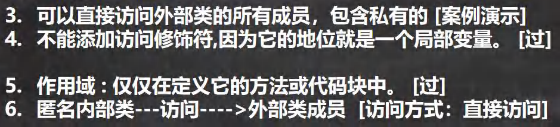

如果定义类在局部位置(方法中/代码块) :(1) 局部内部类 (2) ==匿名内部类==

定义在成员位置 (1) 成员内部类 (2) 静态内部类

### 08.1 基本介绍


### 08.2 基本语法


### 08.3 快速入门案例

> 代码

```java
package com.hspedu.innerclass;

public class InnerClass01 { //外部其他类
    public static void main(String[] args) {

    }
}
class Outer { //外部类
    private int n1 = 100;//属性
    public Outer(int n1) {//构造器
        this.n1 = n1;
    }
    public void m1() {//方法
        System.out.println("m1()");
    }
    {//代码块
        System.out.println("代码块...");
    }
    class Inner { //内部类, 在Outer类的内部

    }
}
```

### 08.4 内部类的分类


### 08.5 局部内部类的使用 LocalInnerClass.java


> 代码

```java
package com.hspedu.innerclass;
/**
 * 演示局部内部类的使用
 */
public class LocalInnerClass {//
    public static void main(String[] args) {
        //演示一遍
        Outer02 outer02 = new Outer02();
        outer02.m1();
        System.out.println("outer02的hashcode=" + outer02);
    }
}


class Outer02 {//外部类
    private int n1 = 100;
    private void m2() {
        System.out.println("Outer02 m2()");
    }//私有方法
    public void m1() {//方法
        //1.局部内部类是定义在外部类的局部位置,通常在方法
        //3.不能添加访问修饰符,但是可以使用final 修饰
        //4.作用域 : 仅仅在定义它的方法或代码块中
        final class Inner02 {//局部内部类(本质仍然是一个类)
            //2.可以直接访问外部类的所有成员，包含私有的
            private int n1 = 800;
            public void f1() {
                //5. 局部内部类可以直接访问外部类的成员，比如下面 外部类n1 和 m2()
                //7. 如果外部类和局部内部类的成员重名时，默认遵循就近原则，如果想访问外部类的成员，
                //   使用 外部类名.this.成员）去访问
                //   老韩解读 Outer02.this 本质就是外部类的对象, 即哪个对象调用了m1, Outer02.this就是哪个对象
                System.out.println("n1=" + n1 + " 外部类的n1=" + Outer02.this.n1);
                System.out.println("Outer02.this hashcode=" + Outer02.this);
                m2();
            }
        }
        //6. 外部类在方法中，可以创建Inner02对象，然后调用方法即可
        Inner02 inner02 = new Inner02();
        inner02.f1();
    }

}
```

### 08.6 匿名内部类的使用(重要!!!!!!!)


> 代码

```java
package com.hspedu.innerclass;


/**
 * 演示匿名内部类的使用
 */
public class AnonymousInnerClass {
    public static void main(String[] args) {
        Outer04 outer04 = new Outer04();
        outer04.method();
    }
}

class Outer04 { //外部类
    private int n1 = 10;//属性
    public void method() {//方法
        //基于接口的匿名内部类
        //老韩解读
        //1.需求： 想使用IA接口,并创建对象
        //2.传统方式，是写一个类，实现该接口，并创建对象
        //3.老韩需求是 Tiger/Dog 类只是使用一次，后面再不使用
        //4. 可以使用匿名内部类来简化开发
        //5. tiger的编译类型 ? IA
        //6. tiger的运行类型 ? 就是匿名内部类  Outer04$1
        /*
            我们看底层 会分配 类名 Outer04$1
            class Outer04$1 implements IA {
                @Override
                public void cry() {
                    System.out.println("老虎叫唤...");
                }
            }
         */
        //7. jdk底层在创建匿名内部类 Outer04$1,立即马上就创建了 Outer04$1实例，并且把地址
        //   返回给 tiger
        //8. 匿名内部类使用一次，就不能再使用
        IA tiger = new IA() {
            @Override
            public void cry() {
                System.out.println("老虎叫唤...");
            }
        };
        System.out.println("tiger的运行类型=" + tiger.getClass());
        tiger.cry();
        tiger.cry();
        tiger.cry();

//        IA tiger = new Tiger();
//        tiger.cry();

        //演示基于类的匿名内部类
        //分析
        //1. father编译类型 Father
        //2. father运行类型 Outer04$2
        //3. 底层会创建匿名内部类
        /*
            class Outer04$2 extends Father{
                @Override
                public void test() {
                    System.out.println("匿名内部类重写了test方法");
                }
            }
         */
        //4. 同时也直接返回了 匿名内部类 Outer04$2的对象
        //5. 注意("jack") 参数列表会传递给 构造器
        Father father = new Father("jack"){

            @Override
            public void test() {
                System.out.println("匿名内部类重写了test方法");
            }
        };
        System.out.println("father对象的运行类型=" + father.getClass());//Outer04$2
        father.test();

        //基于抽象类的匿名内部类
        Animal animal = new Animal(){
            @Override
            void eat() {
                System.out.println("小狗吃骨头...");
            }
        };
        animal.eat();
    }
}

interface IA {//接口
    public void cry();
}
//class Tiger implements IA {
//
//    @Override
//    public void cry() {
//        System.out.println("老虎叫唤...");
//    }
//}
//class Dog implements  IA{
//    @Override
//    public void cry() {
//        System.out.println("小狗汪汪...");
//    }
//}

class Father {//类
    public Father(String name) {//构造器
        System.out.println("接收到name=" + name);
    }
    public void test() {//方法
    }
}

abstract class Animal { //抽象类
    abstract void eat();
}
```





> 代码

```java
package com.hspedu.innerclass;

public class AnonymousInnerClassDetail {
    public static void main(String[] args) {

        Outer05 outer05 = new Outer05();
        outer05.f1();
        //外部其他类---不能访问----->匿名内部类
        System.out.println("main outer05 hashcode=" + outer05);
    }
}

class Outer05 {
    private int n1 = 99;
    public void f1() {
        //创建一个基于类的匿名内部类
        //不能添加访问修饰符,因为它的地位就是一个局部变量
        //作用域 : 仅仅在定义它的方法或代码块中
        Person p = new Person(){
            private int n1 = 88;
            @Override
            public void hi() {
                //可以直接访问外部类的所有成员，包含私有的
                //如果外部类和匿名内部类的成员重名时，匿名内部类访问的话，
                //默认遵循就近原则，如果想访问外部类的成员，则可以使用 （外部类名.this.成员）去访问
                System.out.println("匿名内部类重写了 hi方法 n1=" + n1 +
                        " 外部内的n1=" + Outer05.this.n1 );
                //Outer05.this 就是调用 f1的 对象
                System.out.println("Outer05.this hashcode=" + Outer05.this);
            }
        };
        p.hi();//动态绑定, 运行类型是 Outer05$1

        //也可以直接调用, 匿名内部类本身也是返回对象
        // class 匿名内部类 extends Person {}
//        new Person(){
//            @Override
//            public void hi() {
//                System.out.println("匿名内部类重写了 hi方法,哈哈...");
//            }
//            @Override
//            public void ok(String str) {
//                super.ok(str);
//            }
//        }.ok("jack");


    }
}

class Person {//类
    public void hi() {
        System.out.println("Person hi()");
    }
    public void ok(String str) {
        System.out.println("Person ok() " + str);
    }
}
//抽象类/接口...
```

### 08.7 匿名内部类的最佳实践

当做实参直接传递，简洁高效。 InnerClassExercise01.java

```java
package com.hspedu.innerclass;

import com.hspedu.abstract_.AA;

public class InnerClassExercise01 {
    public static void main(String[] args) {

        //当做实参直接传递，简洁高效
        f1(new IL() {
            @Override
            public void show() {
                System.out.println("这是一副名画~~...");
            }
        });
        //传统方法
        f1(new Picture());

    }

    //静态方法,形参是接口类型
    public static void f1(IL il) {
        il.show();
    }
}
//接口
interface IL {
    void show();
}
//类->实现IL => 编程领域 (硬编码)
class Picture implements IL {

    @Override
    public void show() {
        System.out.println("这是一副名画XX...");
    }
}
```

### 08.8 匿名内部类课堂练习


> 代码

```java
package com.hspedu.innerclass;

public class InnerClassExercise02 {
    public static void main(String[] args) {
        /*
        1.有一个铃声接口Bell，里面有个ring方法。(右图)
        2.有一个手机类Cellphone，具有闹钟功能alarmClock，参数是Bell类型(右图)
        3.测试手机类的闹钟功能，通过匿名内部类(对象)作为参数，打印：懒猪起床了
        4.再传入另一个匿名内部类(对象)，打印：小伙伴上课了
         */
        CellPhone cellPhone = new CellPhone();
        //老韩解读
        //1. 传递的是实现了 Bell接口的匿名内部类 InnerClassExercise02$1
        //2. 重写了 ring
        //3. Bell bell = new Bell() {
        //            @Override
        //            public void ring() {
        //                System.out.println("懒猪起床了");
        //            }
        //        }
        cellPhone.alarmClock(new Bell() {
            @Override
            public void ring() {
                System.out.println("懒猪起床了");
            }
        });

        cellPhone.alarmClock(new Bell() {
            @Override
            public void ring() {
                System.out.println("小伙伴上课了");
            }
        });
    }
}
interface Bell{ //接口
    void ring();//方法
}
class CellPhone{//类
    public void alarmClock(Bell bell){//形参是Bell接口类型
        System.out.println(bell.getClass());
        bell.ring();//动态绑定
    }
}
```

### 08.9 成员内部类的使用


> 代码

```java
package com.hspedu.innerclass;

public class MemberInnerClass01 {
    public static void main(String[] args) {
        Outer08 outer08 = new Outer08();
        outer08.t1();

        //外部其他类，使用成员内部类的三种方式
        //老韩解读
        // 第一种方式
        // outer08.new Inner08(); 相当于把 new Inner08()当做是outer08成员
        // 这就是一个语法，不要特别的纠结.
        Outer08.Inner08 inner08 = outer08.new Inner08();
        inner08.say();
        // 第二方式 在外部类中，编写一个方法，可以返回 Inner08对象
        Outer08.Inner08 inner08Instance = outer08.getInner08Instance();
        inner08Instance.say();


    }
}

class Outer08 { //外部类
    private int n1 = 10;
    public String name = "张三";

    private void hi() {
        System.out.println("hi()方法...");
    }

    //1.注意: 成员内部类，是定义在外部内的成员位置上
    //2.可以添加任意访问修饰符(public、protected 、默认、private),因为它的地位就是一个成员
    public class Inner08 {//成员内部类
        private double sal = 99.8;
        private int n1 = 66;
        public void say() {
            //可以直接访问外部类的所有成员，包含私有的
            //如果成员内部类的成员和外部类的成员重名，会遵守就近原则.
            //，可以通过  外部类名.this.属性 来访问外部类的成员
            System.out.println("n1 = " + n1 + " name = " + name + " 外部类的n1=" + Outer08.this.n1);
            hi();
        }
    }
    //方法，返回一个Inner08实例
    public Inner08 getInner08Instance(){
        return new Inner08();
    }


    //写方法
    public void t1() {
        //使用成员内部类
        //创建成员内部类的对象，然后使用相关的方法
        Inner08 inner08 = new Inner08();
        inner08.say();
        System.out.println(inner08.sal);
    }
}
```

### 08.10 静态内部类的使用 StaticInnerClass01.java


> 代码

```java
package com.hspedu.innerclass;

public class StaticInnerClass01 {
    public static void main(String[] args) {
        Outer10 outer10 = new Outer10();
        outer10.m1();

        //外部其他类 使用静态内部类
        //方式1
        //因为静态内部类，是可以通过类名直接访问(前提是满足访问权限)
        Outer10.Inner10 inner10 = new Outer10.Inner10();
        inner10.say();
        //方式2
        //编写一个方法，可以返回静态内部类的对象实例.
        Outer10.Inner10 inner101 = outer10.getInner10();
        System.out.println("============");
        inner101.say();

        Outer10.Inner10 inner10_ = Outer10.getInner10_();
        System.out.println("************");
        inner10_.say();
    }
}

class Outer10 { //外部类
    private int n1 = 10;
    private static String name = "张三";
    private static void cry() {}
    //Inner10就是静态内部类
    //1. 放在外部类的成员位置
    //2. 使用static 修饰
    //3. 可以直接访问外部类的所有静态成员，包含私有的，但不能直接访问非静态成员
    //4. 可以添加任意访问修饰符(public、protected 、默认、private),因为它的地位就是一个成员
    //5. 作用域 ：同其他的成员，为整个类体
    static class Inner10 {
        private static String name = "韩顺平教育";
        public void say() {
            //如果外部类和静态内部类的成员重名时，静态内部类访问的时，
            //默认遵循就近原则，如果想访问外部类的成员，则可以使用 （外部类名.成员）
            System.out.println(name + " 外部类name= " + Outer10.name);
            cry();
        }
    }

    public void m1() { //外部类---访问------>静态内部类 访问方式：创建对象，再访问
        Inner10 inner10 = new Inner10();
        inner10.say();
    }

    public Inner10 getInner10() {
        return new Inner10();
    }

    public static Inner10 getInner10_() {
        return new Inner10();
    }
}
```

### 08.11 课堂测试题

```java
public class Test {//外部类
   public Test() {//构造器 
    Inner s1 = new Inner();
     s1.a = 10; 
    Inner s2 = new Inner(); 
    System.out.println(s2.a); 
  }
  class Inner { //内部类，成员内部类
     public int a = 5; 
  }
  public static void main(String[] args) { 
    Test t = new Test(); 
    Inner r = t.new Inner();//5 
    System.out.println(r.a);//5 
  } 
}
```