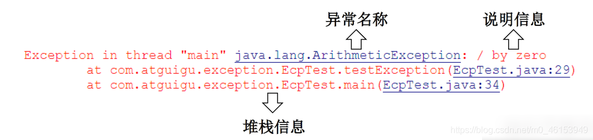
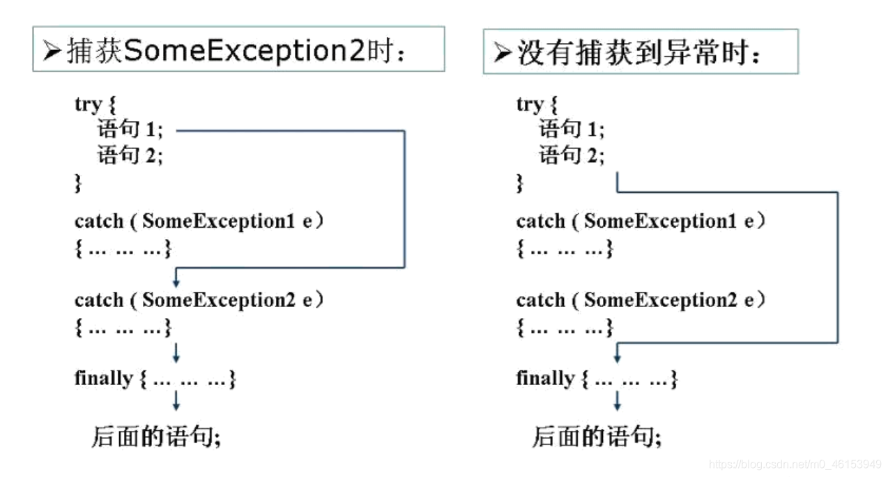

在编写程序时，经常要在可能出现错误的地方加上检测的代码，如进行x/y运算时，要检测分母为0，数据为空，输入的不是数据而是字符等。过多的if-else分支会导致程序的代码加长、臃肿，可读性差。因此采用异常处理机制。

> Java异常处理:

Java采用的异常处理机制，是将异常处理的程序代码集中在一起，与正常的程序代码分开，使得程序简洁、优雅，并易于维护。

方式一：try-catch-finally

方式二：[throws](https://so.csdn.net/so/search?q=throws&spm=1001.2101.3001.7020) + 异常类型

> Java异常处理的方式: try-catch-finally

- try

  - 捕获异常的第一步是用try{…}语句块选定捕获异常的范围，将可能出现异常的代码放在try语句块中。

- catch(Exceptiontypee)

- 在catch语句块中是对异常对象进行处理的代码。每个try语句块可以伴随一个或多个catch语句，用于处理可能产生的不同类型的异常对象。

- 捕获异常的有关信息：与其它对象一样，可以访问一个异常对象的成员变量或调用它的方法。

  - getMessage() 获取异常信息，返回字符串
  - printStackTrace() 获取异常类名和异常信息，以及异常出现在程序中的位置。返回值void。 

  

- finally

  - 捕获异常的最后一步是通过finally语句为异常处理提供一个统一的出口，使得在控制流转到程序的其它部分以前，能够对程序的状态作统一的管理。
  - 不论在try代码块中是否发生了异常事件，catch语句是否执行，catch语句是否有异常，catch语句中是否有return，finally块中的语句都会被执行。
  - finally语句和catch语句是任选的 

  

```java
import java.io.File;
import java.io.FileInputStream;
import java.io.FileNotFoundException;
import java.io.IOException;

import org.junit.Test;

/*
 * 异常的处理:抓抛模型
 * 
 * 过程一:“抛”：程序在征程执行过程中，一旦出现异常，就会在异常代码处生成一个对应异常类的对象
 *        并将此对象抛出。
 *       一旦抛出对象以后，其后的代码就不再执行。
 * 
 * 过程二:“抓”:可以理解为异常的处理方式：① try-catch-finally  ② throws
 * 
 * 二、try-catch-finally的使用
 * 
 * try{
 *     //可能出现异常的代码
 * }catch(异常类型1 变量名1){
 *     //处理异常的方式1
 * }catch(异常类型2 变量名2){
 *     //处理异常的方式2
 * }catch(异常类型3 变量名3){
 *     //处理异常的方式3
 * }
 * ...
 * finally{
 *     //一定会执行的代码
 * }
 * 
 * 说明:
 * 1.finally是可选的。
 * 2.使用try将可能出现异常代码包装起来，在执行过程中，一旦出现异常，就会生成一个对应异常类的对象，根据此对象
 *   的类型，去catch中进行匹配。
 * 3.一旦try中的异常对象匹配到某一个catch时，就进入catch中进行异常的处理。一旦处理完成，就跳出当前的
 *   try-catch结构（在没有写finally的情况）。继续执行其后的代码。
 * 4.catch中的异常类型如果没有子父类关系，则谁声明在上，谁声明在下无所谓。
 *   catch中的异常类型如果满足子父类关系，则要求子类一定声明在父类的上面。否则，报错
 * 5.常用的异常对象处理的方式： ① String  getMessage()    ② printStackTrace()
 * 6.在try结构中声明的变量，再出了try结构以后，就不能再被调用,例65行:System.out.println(num);
 * 7.try-catch-finally结构可以嵌套  
 * 
 * 体会1：使用try-catch-finally处理编译时异常，是得程序在编译时就不再报错，但是运行时仍可能报错。
 *     相当于我们使用try-catch-finally将一个编译时可能出现的异常，延迟到运行时出现。
 *   
 * 体会2：开发中，由于运行时异常比较常见，所以我们通常就不针对运行时异常编写try-catch-finally了。
 *      针对于编译时异常，我们说一定要考虑异常的处理。
 */
public class ExceptionTest1 { 

  @Test
  public void test2(){ 
    try{ 
      File file = new File("hello.txt");
      FileInputStream fis = new FileInputStream(file);
    
      int data = fis.read();
      while(data != -1){ 
        System.out.print((char)data);
        data = fis.read();
      }
    
      fis.close();
    }catch(FileNotFoundException e){ 
      e.printStackTrace();
    }catch(IOException e){ 
      e.printStackTrace();
    }
  }

  @Test
  public void test1(){ 
  
    String str = "123";
    str = "abc";
    try{ 
      int num = Integer.parseInt(str);
    
      System.out.println("hello-----1");
    }catch(NumberFormatException e){ 
//      System.out.println("出现数值转换异常了，不要着急....");
      //String getMessage():
//      System.out.println(e.getMessage());
      //printStackTrace():
      e.printStackTrace();
    }catch(NullPointerException e){ 
      System.out.println("出现空指针异常了，不要着急....");
    }catch(Exception e){ 
      System.out.println("出现异常了，不要着急....");
    }
//    System.out.println(num);
  
    System.out.println("hello----2");
  }
}
```

### 3.1、finally的使用

```java
import java.io.File;
import java.io.FileInputStream;
import java.io.FileNotFoundException;
import java.io.IOException;

import org.junit.Test;

/*
 * try-catch-finally中finally的使用：
 * 
 * 1.finally是可选的。
 * 2.finally中声明的是一定会被执行的代码。即使catch中又出现异常了，try中有return语句，catch中有
 *   return语句等情况。
 * 3.像数据库连接、输入输出流、网络编程Socket等资源，JVM是不能自动的回收的，我们需要自己手动的进行资源的
 *   释放。此时的资源释放，就需要声明在finally中。
 * 
 */
public class FinallyTest { 

  @Test
  public void test2() { 
    FileInputStream fis = null;
    try { 
      File file = new File("hello1.txt");//文件可能不存在，而出现异常
      fis = new FileInputStream(file);

      int data = fis.read();
      while (data != -1) { 
        System.out.print((char) data);
        data = fis.read();
      }

    } catch (FileNotFoundException e) { 
      e.printStackTrace();
    } catch (IOException e) { 
      e.printStackTrace();
    } finally { 
      try { 
        if (fis != null)
          fis.close();
      } catch (IOException e) { 
        e.printStackTrace();
      }
    }
  }

  @Test
  public void testMethod() { 
    int num = method();
    System.out.println(num);
  }

  public int method() { 

    try { 
      int[] arr = new int[10];
      System.out.println(arr[10]);
      return 1;
    } catch (ArrayIndexOutOfBoundsException e) { 
      e.printStackTrace();
      return 2;
    } finally { 
      System.out.println("我一定会被执行");
      return 3;
    }
  }

  @Test
  public void test1() { 
    try { 
      int a = 10;
      int b = 0;
      System.out.println(a / b);
    } catch (ArithmeticException e) { 
      // e.printStackTrace();

      int[] arr = new int[10];
      System.out.println(arr[10]);

    } catch (Exception e) { 
      e.printStackTrace();
    }
    // System.out.println("我好慢呀~~~");
    finally { 
      System.out.println("我好慢呀~~~");
    }
  }
}
```