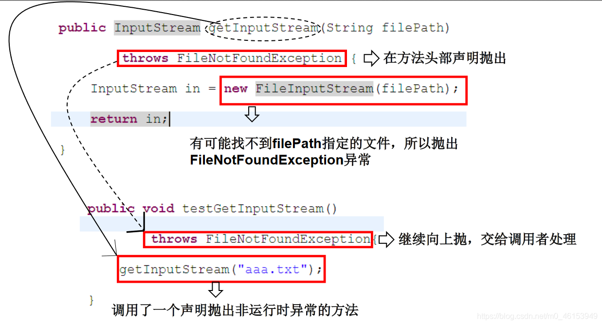

- 声明抛出异常是Java中处理异常的第二种方式
  - 如果一个方法(中的语句执行时)可能生成某种异常，但是并不能确定如何处理这种异常，则此方法应显示地声明抛出异常，表明该方法将不对这些异常进行处理，而由该方法的调用者负责处理。
- 在方法声明中用throws语句可以声明抛出异常的列表，throws后面的异常类型可以是方法中产生的异常类型，也可以是它的父类。

```java
/*
 * 异常处理的方式二：throws + 异常类型
 * 
 * 1. "throws + 异常类型"写在方法的声明处。指明此方法执行时，可能会抛出的异常类型。
 *     一旦当方法体执行时，出现异常，仍会在异常代码处生成一个异常类的对象，此对象满足throws后异常
 *     类型时，就会被抛出。异常代码后续的代码，就不再执行！
 *
 *     关于异常对象的产生:① 系统自动生成的异常对象
 *           ② 手动生成一个异常对象，并抛出(throw)
 *   
 * 2. 体会：try-catch-finally:真正的将异常给处理掉了。
 *        throws的方式只是将异常抛给了方法的调用者。  并没有真正将异常处理掉。  
 * 
 */
public class ExceptionTest2 { 

  public static void main(String[] args){ 
    try { 
      method2();
    } catch (IOException e) { 
      e.printStackTrace();
    }
  
    method3();
  }

  public static void method3(){ 
    try { 
      method2();
    } catch (IOException e) { 
      e.printStackTrace();
    }
  }

  public static void method2() throws IOException{ 
    method1();
  }


  public static void method1() throws FileNotFoundException,IOException{ 
    File file = new File("hello1.txt");
    FileInputStream fis = new FileInputStream(file);
  
    int data = fis.read();
    while(data != -1){ 
      System.out.print((char)data);
      data = fis.read();
    }
  
    fis.close();
  
    System.out.println("hahaha!");
  }
}
```




### 4.1、[重写](https://so.csdn.net/so/search?q=重写&spm=1001.2101.3001.7020)方法声明抛出异常的原则

```java
import java.io.FileNotFoundException;
import java.io.IOException;

/*
 * 方法重写的规则之一：
 * 子类重写的方法抛出的异常类型不大于父类被重写的方法抛出的异常类型
 * 
 */
public class OverrideTest { 

  public static void main(String[] args) { 
    OverrideTest test = new OverrideTest();
    test.display(new SubClass());
  }

  public void display(SuperClass s){ 
    try { 
      s.method();
    } catch (IOException e) { 
      e.printStackTrace();
    }
  }

}
class SuperClass{ 

  public void method() throws IOException{ 
  
  }
}
class SubClass extends SuperClass{ 
  public void method()throws FileNotFoundException{ 
  
  }
}
/* 3. 开发中如何选择使用try-catch-finally 还是使用throws？
 *   3.1 如果父类中被重写的方法没有throws方式处理异常，则子类重写的方法也不能使用throws，意味着如果
 *       子类重写的方法中有异常，必须使用try-catch-finally方式处理。
 *   3.2 执行的方法a中，先后又调用了另外的几个方法，这几个方法是递进关系执行的。我们建议这几个方法使用throws
 *       的方式进行处理。而执行的方法a可以考虑使用try-catch-finally方式进行处理。
 */
```