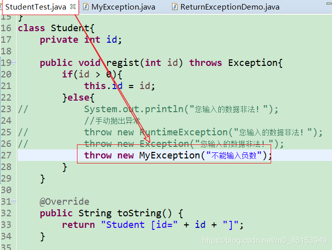

- 一般地，用户自定义异常类都是RuntimeException的子类。
- 自定义异常类通常需要编写几个重载的构造器。
- 自定义异常需要提供serialVersionUID
- 自定义的异常通过throw抛出。
- 自定义异常最重要的是异常类的名字，当异常出现时，可以根据名字判断异常类型。

```java
/*
 * 如何自定义异常类？
 * 1.继承于现有的异常结构：RuntimeException 、Exception
 * 2.提供全局常量：serialVersionUID
 * 3.提供重载的构造器
 * 
 */
public class MyException extends RuntimeException{ 
  static final long serialVersionUID = -7034897193246939L;

  public MyException(){ 
  
  }

  public MyException(String msg){ 
    super(msg);
  }
}
```




### 6.1、练习

> 练习1——ReturnExceptionDemo类

```java
public class ReturnExceptionDemo { 
  static void methodA() { 
    try { 
      System.out.println("进入方法A");
      throw new RuntimeException("制造异常");
    } finally { 
      System.out.println("用A方法的finally");
    }
  }

  static void methodB() { 
    try { 
      System.out.println("进入方法B");
      return;
    } finally { 
      System.out.println("调用B方法的finally");
    }
  }

  public static void main(String[] args) { 
    try { 
      methodA();
    } catch (Exception e) { 
      System.out.println(e.getMessage());
    }
    
    methodB();
  }
}
```

> 练习2

```java
/*
 * 编写应用程序EcmDef.java，接收命令行的两个参数，
 *     要求不能输入负数，计算两数相除。
 *     对 数 据 类 型 不 一 致(NumberFormatException)、
 *     缺 少 命 令 行 参 数(ArrayIndexOutOfBoundsException、
 *     除0(ArithmeticException)及输入负数(EcDef自定义的异常)进行异常处理。
 *
 * 提示：
 *     (1)在主类(EcmDef)中定义异常方法(ecm)完成两数相除功能。
 *     (2)在main()方法中使用异常处理语句进行异常处理。
 *     (3)在程序中，自定义对应输入负数的异常类(EcDef)。
 *     (4)运行时接受参数java EcmDef2010//args[0]=“20”args[1]=“10”
 *     (5)Interger类的static方法parseInt(Strings)将s转换成对应的int值。
 *     如：int a=Interger.parseInt(“314”);//a=314;
 */
public class EcmDef { 
  public static void main(String[] args) { 
    try { 
      int i = Integer.parseInt(args[0]);
      int j = Integer.parseInt(args[0]);
    
      int result = ecm(i,j);
    
      System.out.println(result);
    } catch (NumberFormatException e) { 
      System.out.println("数据类型不一致");
    }catch (ArrayIndexOutOfBoundsException e){ 
      System.out.println("缺少命令行参数");
    }catch (ArithmeticException e){ 
      System.out.println("除0");
    }catch (EcDef e) { 
      System.out.println(e.getMessage());
    }
  }

  public static int ecm(int i, int j) throws EcDef{ 
    if(i < 0 || j < 0){ 
      throw new EcDef("分子或分母为负数了！");
    }
    return i / j;
  }
}
```

> 练习2的自定义异常类——EcDef

```java
//自定义异常类
public class EcDef extends Exception { 

  static final long serialVersionUID = -33875164229948L;

  public EcDef() { 
  
  }

  public EcDef(String msg) { 
    super(msg);
  }
}
```