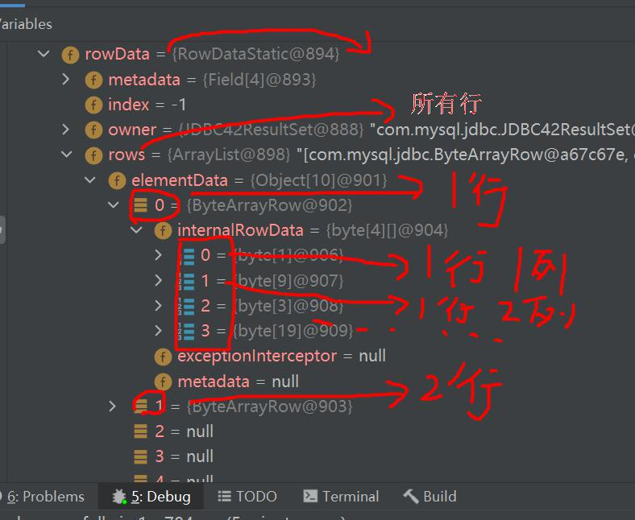
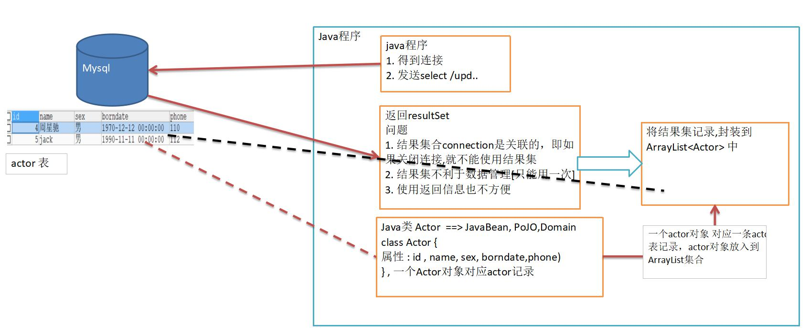

# 第 25 章JDBC 和数据库连接池

# 第 25 章JDBC 和数据库连接池

## 25.1 JDBC 概述

### 25.1.1 基本介绍

​

​

### 25.1.2 模拟 JDBC

```java
package com.hspedu.jdbc.myjdbc;

/**
 * @author 韩顺平
 * @version 1.0
 * 我们规定的jdbc接口(方法)
 */
public interface JdbcInterface {

    //连接
    public Object getConnection() ;
    //crud
    public void crud();
    //关闭连接
    public void close();
}

```

```java
package com.hspedu.jdbc.myjdbc;

/**
 * @author 韩顺平
 * @version 1.0
 * mysql 数据库实现了jdbc接口 [模拟] 【mysql厂商开发】
 */
public class MysqlJdbcImpl implements  JdbcInterface{
    @Override
    public Object getConnection() {
        System.out.println("得到 mysql 的连接");
        return null;
    }

    @Override
    public void crud() {
        System.out.println("完成 mysql 增删改查");
    }

    @Override
    public void close() {
        System.out.println("关闭 mysql 的连接");
    }
}

```

```java
package com.hspedu.jdbc.myjdbc;

/**
 * @author 韩顺平
 * @version 1.0
 * 模拟oracle数据库实现 jdbc
 */
public class OracleJdbcImpl implements  JdbcInterface {
    @Override
    public Object getConnection() {
        System.out.println("得到 oracle的连接 升级");
        return null;
    }

    @Override
    public void crud() {
        System.out.println("完成 对oracle的增删改查");
    }

    @Override
    public void close() {
        System.out.println("关闭 oracle的连接");
    }
}

```

```java
package com.hspedu.jdbc.myjdbc;

import org.junit.jupiter.api.Test;

import java.io.FileInputStream;
import java.sql.Connection;
import java.sql.DriverManager;
import java.sql.ResultSet;
import java.sql.Statement;
import java.util.Properties;
import java.util.Scanner;

/**
 * @author 韩顺平
 * @version 1.0
 */
public class TestJDBC {
    public static void main(String[] args) throws Exception {
        //完成对mysql的操作
        JdbcInterface jdbcInterface = new MysqlJdbcImpl();
        jdbcInterface.getConnection(); //通过接口来调用实现类[动态绑定]
        jdbcInterface.crud();
        jdbcInterface.close();


        //完成对oracle的操作
        System.out.println("==============================");
        jdbcInterface = new OracleJdbcImpl();
        jdbcInterface.getConnection(); //通过接口来调用实现类[动态绑定]
        jdbcInterface.crud();
        jdbcInterface.close();

    }

}

```

### 25.1.3 JDBC 带来的好处

​

​

### 25.1.4 JDBC API

​

## 25.2 JDBC 快速入门

### 25.2.1 JDBC 程序编写步骤

​

### 25.2.2 JDBC 第一个程序

​

### 25.2.3 JDBC 第一个程序 com.hspedu.jdbc Jdbc01.java

```java
package com.hspedu.jdbc;

import com.mysql.jdbc.Driver;

import java.sql.Connection;
import java.sql.SQLException;
import java.sql.Statement;
import java.util.Properties;

/**
 * @author 韩顺平
 * @version 1.0
 * 这是第一个Jdbc 程序，完成简单的操作
 */
public class Jdbc01 {
    public static void main(String[] args) throws SQLException {

        //前置工作： 在项目下创建一个文件夹比如 libs
        // 将 mysql.jar 拷贝到该目录下，点击 add to project ..加入到项目中
        //1. 注册驱动
        Driver driver = new Driver(); //创建driver对象

        //2. 得到连接
        // 老师解读
        //(1) jdbc:mysql:// 规定好表示协议，通过jdbc的方式连接mysql
        //(2) localhost 主机，可以是ip地址
        //(3) 3306 表示mysql监听的端口
        //(4) hsp_db02 连接到mysql dbms 的哪个数据库
        //(5) mysql的连接本质就是前面学过的socket连接
        String url = "jdbc:mysql://localhost:3306/hsp_db02";
        //将 用户名和密码放入到Properties 对象
        Properties properties = new Properties();
        //说明 user 和 password 是规定好，后面的值根据实际情况写
        properties.setProperty("user", "root");// 用户
        properties.setProperty("password", "hsp"); //密码
        Connection connect = driver.connect(url, properties);

        //3. 执行sql
        //String sql = "insert into actor values(null, '刘德华', '男', '1970-11-11', '110')";
        //String sql = "update actor set name='周星驰' where id = 1";
        String sql = "delete from actor where id = 1";
        //statement 用于执行静态SQL语句并返回其生成的结果的对象
        Statement statement = connect.createStatement();
        int rows = statement.executeUpdate(sql); // 如果是 dml语句，返回的就是影响行数

        System.out.println(rows > 0 ? "成功" : "失败");

        //4. 关闭连接资源
        statement.close();
        connect.close();

    }
}

```

## 25.3 获取数据库连接 5 种方式

### 25.3.1 方式 1

​

### 25.3.2 方式 2

​

### 25.3.3 方式 3

​

### 25.3.4 方式 4

​

### 25.3.5 方式 5

​

```java
package com.hspedu.jdbc;

import com.mysql.jdbc.Driver;
import org.junit.jupiter.api.Test;

import java.io.FileInputStream;
import java.io.FileNotFoundException;
import java.io.IOException;
import java.sql.Connection;
import java.sql.DriverManager;
import java.sql.SQLException;
import java.util.Properties;

/**
 * @author 韩顺平
 * @version 1.0
 * 分析java 连接mysql的5中方式
 */
public class JdbcConn {

    //方式1
    @Test
    public void connect01() throws SQLException {
        Driver driver = new Driver(); //创建driver对象
        String url = "jdbc:mysql://localhost:3306/hsp_db02";
        //将 用户名和密码放入到Properties 对象
        Properties properties = new Properties();
        //说明 user 和 password 是规定好，后面的值根据实际情况写
        properties.setProperty("user", "root");// 用户
        properties.setProperty("password", "hsp"); //密码
        Connection connect = driver.connect(url, properties);
        System.out.println(connect);
    }

    //方式2
    @Test
    public void connect02() throws ClassNotFoundException, IllegalAccessException, InstantiationException, SQLException {
        //使用反射加载Driver类 , 动态加载，更加的灵活，减少依赖性
        Class<?> aClass = Class.forName("com.mysql.jdbc.Driver");
        Driver driver = (Driver)aClass.newInstance();

        String url = "jdbc:mysql://localhost:3306/hsp_db02";
        //将 用户名和密码放入到Properties 对象
        Properties properties = new Properties();
        //说明 user 和 password 是规定好，后面的值根据实际情况写
        properties.setProperty("user", "root");// 用户
        properties.setProperty("password", "hsp"); //密码

        Connection connect = driver.connect(url, properties);
        System.out.println("方式2=" + connect);

    }

    //方式3 使用DriverManager 替代 driver 进行统一管理
    @Test
    public void connect03() throws IllegalAccessException, InstantiationException, ClassNotFoundException, SQLException {

        //使用反射加载Driver
        Class<?> aClass = Class.forName("com.mysql.jdbc.Driver");
        Driver driver = (Driver) aClass.newInstance();

        //创建url 和 user 和 password
        String url = "jdbc:mysql://localhost:3306/hsp_db02";
        String user = "root";
        String password = "hsp";

        DriverManager.registerDriver(driver);//注册Driver驱动

        Connection connection = DriverManager.getConnection(url, user, password);
        System.out.println("第三种方式=" + connection);
    }

    //方式4: 使用Class.forName 自动完成注册驱动，简化代码
    //这种方式获取连接是使用的最多，推荐使用
    @Test
    public void connect04() throws ClassNotFoundException, SQLException {
        //使用反射加载了 Driver类
        //在加载 Driver类时，完成注册
        /*
            源码: 1. 静态代码块，在类加载时，会执行一次.
            2. DriverManager.registerDriver(new Driver());
            3. 因此注册driver的工作已经完成
            static {
                try {
                    DriverManager.registerDriver(new Driver());
                } catch (SQLException var1) {
                    throw new RuntimeException("Can't register driver!");
                }
            }
         */
        Class.forName("com.mysql.jdbc.Driver");

        //创建url 和 user 和 password
        String url = "jdbc:mysql://localhost:3306/hsp_db02";
        String user = "root";
        String password = "hsp";
        Connection connection = DriverManager.getConnection(url, user, password);

        System.out.println("第4种方式~ " + connection);

    }

    //方式5 , 在方式4的基础上改进，增加配置文件，让连接mysql更加灵活
    @Test
    public void connect05() throws IOException, ClassNotFoundException, SQLException {

        //通过Properties对象获取配置文件的信息
        Properties properties = new Properties();
        properties.load(new FileInputStream("src\\mysql.properties"));
        //获取相关的值
        String user = properties.getProperty("user");
        String password = properties.getProperty("password");
        String driver = properties.getProperty("driver");
        String url = properties.getProperty("url");

        Class.forName(driver);//建议写上

        Connection connection = DriverManager.getConnection(url, user, password);

        System.out.println("方式5 " + connection);


    }

}

```

### 25.3.6 课堂练习

​

## 25.4 ResultSet[结果集]

### 25.4.1 基本介绍

​

​

### 25.4.2 应用实例

​

```java
package com.hspedu.jdbc.resultset_;

import java.io.FileInputStream;
import java.io.FileNotFoundException;
import java.io.IOException;
import java.sql.*;
import java.util.Properties;

/**
 * @author 韩顺平
 * @version 1.0
 * 演示select 语句返回 ResultSet ,并取出结果
 */
@SuppressWarnings({"all"})
public class ResultSet_ {
    public static void main(String[] args) throws Exception {

        //通过Properties对象获取配置文件的信息


        Properties properties = new Properties();
        properties.load(new FileInputStream("src\\mysql.properties"));
        //获取相关的值
        String user = properties.getProperty("user");
        String password = properties.getProperty("password");
        String driver = properties.getProperty("driver");
        String url = properties.getProperty("url");

        //1. 注册驱动
        Class.forName(driver);//建议写上

        //2. 得到连接
        Connection connection = DriverManager.getConnection(url, user, password);

        //3. 得到Statement
        Statement statement = connection.createStatement();
        //4. 组织SqL
        String sql = "select id, name , sex, borndate from actor";
        //执行给定的SQL语句，该语句返回单个 ResultSet对象
        /*
        +----+-----------+-----+---------------------+
        | id | name      | sex | borndate            |
        +----+-----------+-----+---------------------+-------+
        |  4 | 刘德华    | 男  | 1970-12-12 00:00:00 |
        |  5 | jack      | 男  | 1990-11-11 00:00:00 |
        +----+-----------+-----+---------------------+-------+
         */
        /*
            老韩阅读debug 代码 resultSet 对象的结构


         */
        ResultSet resultSet = statement.executeQuery(sql);

        //5. 使用while取出数据
        while (resultSet.next()) { // 让光标向后移动，如果没有更多行，则返回false
            int id  = resultSet.getInt(1); //获取该行的第1列
            //int id1 = resultSet.getInt("id"); 通过列名来获取值, 推荐
            String name = resultSet.getString(2);//获取该行的第2列
            String sex = resultSet.getString(3);
            Date date = resultSet.getDate(4);

            System.out.println(id + "\t" + name + "\t" + sex + "\t" + date);
        }

        //6. 关闭连接
        resultSet.close();
        statement.close();
        connection.close();

    }
}

```

## 25.5 Statement

### 25.5.1 基本介绍

​

```sql
-- 演示 sql 注入

-- 创建一张表

CREATE TABLE admin ( -- 管理员表

NAME VARCHAR(32) NOT NULL UNIQUE,

pwd VARCHAR(32) NOT NULL DEFAULT '') CHARACTER SET utf8;

-- 添加数据

INSERT INTO admin VALUES('tom', '123');

-- 查找某个管理是否存在

SELECT *

FROM admin

WHERE NAME = 'tom' AND pwd = '123'

-- SQL

-- 输入用户名 为 1' or

-- 输入万能密码 为 or '1'= '1

SELECT *

FROM admin

WHERE NAME = '1' OR' AND pwd = 'OR '1'= '1'

SELECT * FROM admin

```

### 25.5.2 应用实例 Statement_java

​

```java
package com.hspedu.jdbc.statement_;

import java.io.FileInputStream;
import java.io.FileNotFoundException;
import java.sql.*;
import java.util.Properties;
import java.util.Scanner;

/**
 * @author 韩顺平
 * @version 1.0
 * 演示statement 的注入问题
 */
@SuppressWarnings({"all"})
public class Statement_ {
    public static void main(String[] args) throws Exception {

        Scanner scanner = new Scanner(System.in);

        //让用户输入管理员名和密码
        System.out.print("请输入管理员的名字: ");  //next(): 当接收到 空格或者 '就是表示结束
        String admin_name = scanner.nextLine(); // 老师说明，如果希望看到SQL注入，这里需要用nextLine
        System.out.print("请输入管理员的密码: ");
        String admin_pwd = scanner.nextLine();

        //通过Properties对象获取配置文件的信息


        Properties properties = new Properties();
        properties.load(new FileInputStream("src\\mysql.properties"));
        //获取相关的值
        String user = properties.getProperty("user");
        String password = properties.getProperty("password");
        String driver = properties.getProperty("driver");
        String url = properties.getProperty("url");

        //1. 注册驱动
        Class.forName(driver);//建议写上

        //2. 得到连接
        Connection connection = DriverManager.getConnection(url, user, password);

        //3. 得到Statement
        Statement statement = connection.createStatement();
        //4. 组织SqL
        String sql = "select name , pwd  from admin where name ='"
                + admin_name + "' and pwd = '" + admin_pwd + "'";
        ResultSet resultSet = statement.executeQuery(sql);
        if (resultSet.next()) { //如果查询到一条记录，则说明该管理存在
            System.out.println("恭喜， 登录成功");
        } else {
            System.out.println("对不起，登录失败");
        }

        //关闭连接
        resultSet.close();
        statement.close();
        connection.close();

    }
}

```

## 25.6 PreparedStatement

### 25.6.1 基本介绍

​

### 25.6.2 预处理好处

​

### 25.6.3 应用案例

```java
package com.hspedu.jdbc.preparedstatement_;

import java.io.FileInputStream;
import java.io.FileNotFoundException;
import java.sql.*;
import java.util.Properties;
import java.util.Scanner;

/**
 * @author 韩顺平
 * @version 1.0
 * 演示PreparedStatement使用
 */
@SuppressWarnings({"all"})
public class PreparedStatement_ {
    public static void main(String[] args) throws Exception {

        //看 PreparedStatement类图

        Scanner scanner = new Scanner(System.in);

        //让用户输入管理员名和密码
        System.out.print("请输入管理员的名字: ");  //next(): 当接收到 空格或者 '就是表示结束
        String admin_name = scanner.nextLine(); // 老师说明，如果希望看到SQL注入，这里需要用nextLine
        System.out.print("请输入管理员的密码: ");
        String admin_pwd = scanner.nextLine();

        //通过Properties对象获取配置文件的信息

        Properties properties = new Properties();
        properties.load(new FileInputStream("src\\mysql.properties"));
        //获取相关的值
        String user = properties.getProperty("user");
        String password = properties.getProperty("password");
        String driver = properties.getProperty("driver");
        String url = properties.getProperty("url");

        //1. 注册驱动
        Class.forName(driver);//建议写上

        //2. 得到连接
        Connection connection = DriverManager.getConnection(url, user, password);

        //3. 得到PreparedStatement
        //3.1 组织SqL , Sql 语句的 ? 就相当于占位符
        String sql = "select name , pwd  from admin where name =? and pwd = ?";
        //3.2 preparedStatement 对象实现了 PreparedStatement 接口的实现类的对象
        PreparedStatement preparedStatement = connection.prepareStatement(sql);
        //3.3 给 ? 赋值
        preparedStatement.setString(1, admin_name);
        preparedStatement.setString(2, admin_pwd);

        //4. 执行 select 语句使用  executeQuery
        //   如果执行的是 dml(update, insert ,delete) executeUpdate()
        //   这里执行 executeQuery ,不要在写 sql

        ResultSet resultSet = preparedStatement.executeQuery(sql);
        if (resultSet.next()) { //如果查询到一条记录，则说明该管理存在
            System.out.println("恭喜， 登录成功");
        } else {
            System.out.println("对不起，登录失败");
        }

        //关闭连接
        resultSet.close();
        preparedStatement.close();
        connection.close();


    }
}

```

```java
package com.hspedu.jdbc.preparedstatement_;

import java.io.FileInputStream;
import java.sql.Connection;
import java.sql.DriverManager;
import java.sql.PreparedStatement;
import java.sql.ResultSet;
import java.util.Properties;
import java.util.Scanner;

/**
 * @author 韩顺平
 * @version 1.0
 * 演示PreparedStatement使用 dml语句
 */
@SuppressWarnings({"all"})
public class PreparedStatementDML_ {
    public static void main(String[] args) throws Exception {

        //看 PreparedStatement类图

        Scanner scanner = new Scanner(System.in);

        //让用户输入管理员名和密码
        System.out.print("请输删除管理员的名字: ");  //next(): 当接收到 空格或者 '就是表示结束
        String admin_name = scanner.nextLine(); // 老师说明，如果希望看到SQL注入，这里需要用nextLine
//        System.out.print("请输入管理员的新密码: ");
//        String admin_pwd = scanner.nextLine();

        //通过Properties对象获取配置文件的信息

        Properties properties = new Properties();
        properties.load(new FileInputStream("src\\mysql.properties"));
        //获取相关的值
        String user = properties.getProperty("user");
        String password = properties.getProperty("password");
        String driver = properties.getProperty("driver");
        String url = properties.getProperty("url");

        //1. 注册驱动
        Class.forName(driver);//建议写上

        //2. 得到连接
        Connection connection = DriverManager.getConnection(url, user, password);

        //3. 得到PreparedStatement
        //3.1 组织SqL , Sql 语句的 ? 就相当于占位符
        //添加记录
        //String sql = "insert into admin values(?, ?)";
        //String sql = "update admin set pwd = ? where name = ?";
        String sql = "delete from  admin where name = ?";
        //3.2 preparedStatement 对象实现了 PreparedStatement 接口的实现类的对象
        PreparedStatement preparedStatement = connection.prepareStatement(sql);
        //3.3 给 ? 赋值
        preparedStatement.setString(1, admin_name);

        //preparedStatement.setString(2, admin_name);

        //4. 执行 dml 语句使用  executeUpdate
        int rows = preparedStatement.executeUpdate();
        System.out.println(rows > 0 ? "执行成功" : "执行失败");
        //关闭连接
        preparedStatement.close();
        connection.close();


    }
}

```

### 25.6.4 课堂练习

​

## 25.7 JDBC 的相关 API 小结

​

​

## 25.8 封装 JDBCUtils 【关闭连接, 得到连接】

### 25.8.1 说明

​

### 25.8.2 代码实现

### 25.8.3 实际使用使用工具类 JDBCUtils

```java
package com.hspedu.jdbc.utils;

import java.io.FileInputStream;
import java.io.IOException;
import java.sql.*;
import java.util.Properties;

/**
 * @author 韩顺平
 * @version 1.0
 * 这是一个工具类，完成 mysql的连接和关闭资源
 */
public class JDBCUtils {
    //定义相关的属性(4个), 因为只需要一份，因此，我们做出static
    private static String user; //用户名
    private static String password; //密码
    private static String url; //url
    private static String driver; //驱动名

    //在static代码块去初始化
    static {

        try {
            Properties properties = new Properties();
            properties.load(new FileInputStream("src\\mysql.properties"));
            //读取相关的属性值
            user = properties.getProperty("user");
            password = properties.getProperty("password");
            url = properties.getProperty("url");
            driver = properties.getProperty("driver");
        } catch (IOException e) {
            //在实际开发中，我们可以这样处理
            //1. 将编译异常转成 运行异常
            //2. 调用者，可以选择捕获该异常，也可以选择默认处理该异常，比较方便.
            throw new RuntimeException(e);

        }
    }

    //连接数据库, 返回Connection
    public static Connection getConnection() {

        try {
            return DriverManager.getConnection(url, user, password);
        } catch (SQLException e) {
            //1. 将编译异常转成 运行异常
            //2. 调用者，可以选择捕获该异常，也可以选择默认处理该异常，比较方便.
            throw new RuntimeException(e);
        }
    }

    //关闭相关资源
    /*
        1. ResultSet 结果集
        2. Statement 或者 PreparedStatement
        3. Connection
        4. 如果需要关闭资源，就传入对象，否则传入 null
     */
    public static void close(ResultSet set, Statement statement, Connection connection) {

        //判断是否为null
        try {
            if (set != null) {
                set.close();
            }
            if (statement != null) {
                statement.close();
            }
            if (connection != null) {
                connection.close();
            }
        } catch (SQLException e) {
            //将编译异常转成运行异常抛出
            throw new RuntimeException(e);
        }

    }

}

```

```java
package com.hspedu.jdbc.utils;

import org.junit.jupiter.api.Test;

import java.sql.*;

/**
 * @author 韩顺平
 * @version 1.0
 * 该类演示如何使用JDBCUtils工具类，完成dml 和 select
 */
public class JDBCUtils_Use {


    @Test
    public void testSelect() {
        //1. 得到连接
        Connection connection = null;
        //2. 组织一个sql
        String sql = "select * from actor where id = ?";
        PreparedStatement preparedStatement = null;
        ResultSet set = null;
        //3. 创建PreparedStatement 对象
        try {
            connection = JDBCUtils.getConnection();
            System.out.println(connection.getClass()); //com.mysql.jdbc.JDBC4Connection
            preparedStatement = connection.prepareStatement(sql);
            preparedStatement.setInt(1, 5);//给?号赋值
            //执行, 得到结果集
            set = preparedStatement.executeQuery();
            //遍历该结果集
            while (set.next()) {
                int id = set.getInt("id");
                String name = set.getString("name");
                String sex = set.getString("sex");
                Date borndate = set.getDate("borndate");
                String phone = set.getString("phone");
                System.out.println(id + "\t" + name + "\t" + sex + "\t" + borndate + "\t" + phone);
            }
        } catch (SQLException e) {
            e.printStackTrace();
        } finally {
            //关闭资源
            JDBCUtils.close(set, preparedStatement, connection);
        }
    }

    @Test
    public void testDML() {//insert , update, delete

        //1. 得到连接
        Connection connection = null;
        //2. 组织一个sql
        String sql = "update actor set name = ? where id = ?";
        // 测试 delete 和 insert ,自己玩.
        PreparedStatement preparedStatement = null;
        //3. 创建PreparedStatement 对象
        try {
            connection = JDBCUtils.getConnection();

            preparedStatement = connection.prepareStatement(sql);
            //给占位符赋值
            preparedStatement.setString(1, "周星驰");
            preparedStatement.setInt(2, 4);
            //执行
            preparedStatement.executeUpdate();
        } catch (SQLException e) {
            e.printStackTrace();
        } finally {
            //关闭资源
            JDBCUtils.close(null, preparedStatement, connection);
        }
    }
}

```

## 25.9 事务

### 25.9.1 基本介绍

​

### 25.9.2 应用实例

模拟经典的转账业务

​

### 25.9.3 不使用事务可能出现的问题模拟-模拟经典的转账业务

### 25.9.4 使用事务解决上述问题-模拟经典的转账业务

```java
package com.hspedu.jdbc.transaction_;

import com.hspedu.jdbc.utils.JDBCUtils;
import org.junit.jupiter.api.Test;

import java.sql.Connection;
import java.sql.PreparedStatement;
import java.sql.SQLException;

/**
 * @author 韩顺平
 * @version 1.0
 * 演示jdbc 中如何使用事务
 */
public class Transaction_ {

    //没有使用事务.
    @Test
    public void noTransaction() {

        //操作转账的业务
        //1. 得到连接
        Connection connection = null;
        //2. 组织一个sql
        String sql = "update account set balance = balance - 100 where id = 1";
        String sql2 = "update account set balance = balance + 100 where id = 2";
        PreparedStatement preparedStatement = null;
        //3. 创建PreparedStatement 对象
        try {
            connection = JDBCUtils.getConnection(); // 在默认情况下，connection是默认自动提交
            preparedStatement = connection.prepareStatement(sql);
            preparedStatement.executeUpdate(); // 执行第1条sql

            int i = 1 / 0; //抛出异常
            preparedStatement = connection.prepareStatement(sql2);
            preparedStatement.executeUpdate(); // 执行第3条sql


        } catch (SQLException e) {
            e.printStackTrace();
        } finally {
            //关闭资源
            JDBCUtils.close(null, preparedStatement, connection);
        }
    }

    //事务来解决
    @Test
    public void useTransaction() {

        //操作转账的业务
        //1. 得到连接
        Connection connection = null;
        //2. 组织一个sql
        String sql = "update account set balance = balance - 100 where id = 1";
        String sql2 = "update account set balance = balance + 100 where id = 2";
        PreparedStatement preparedStatement = null;
        //3. 创建PreparedStatement 对象
        try {
            connection = JDBCUtils.getConnection(); // 在默认情况下，connection是默认自动提交
            //将 connection 设置为不自动提交
            connection.setAutoCommit(false); //开启了事务
            preparedStatement = connection.prepareStatement(sql);
            preparedStatement.executeUpdate(); // 执行第1条sql

            int i = 1 / 0; //抛出异常
            preparedStatement = connection.prepareStatement(sql2);
            preparedStatement.executeUpdate(); // 执行第3条sql

            //这里提交事务
            connection.commit();

        } catch (SQLException e) {
            //这里我们可以进行回滚，即撤销执行的SQL
            //默认回滚到事务开始的状态.
            System.out.println("执行发生了异常，撤销执行的sql");
            try {
                connection.rollback();
            } catch (SQLException throwables) {
                throwables.printStackTrace();
            }
            e.printStackTrace();
        } finally {
            //关闭资源
            JDBCUtils.close(null, preparedStatement, connection);
        }
    }
}

```

### 25.9.5 课后练习

​

## 25.10批处理

### 25.10.1 基本介绍

​

### 25.10.2 应用实例

​

```java
package com.hspedu.jdbc.batch_;

import com.hspedu.jdbc.utils.JDBCUtils;
import org.junit.jupiter.api.Test;

import java.sql.Connection;
import java.sql.PreparedStatement;
import java.sql.SQLException;

/**
 * @author 韩顺平
 * @version 1.0
 * 演示java的批处理
 */
public class Batch_ {

    //传统方法，添加5000条数据到admin2

    @Test
    public void noBatch() throws Exception {

        Connection connection = JDBCUtils.getConnection();
        String sql = "insert into admin2 values(null, ?, ?)";
        PreparedStatement preparedStatement = connection.prepareStatement(sql);
        System.out.println("开始执行");
        long start = System.currentTimeMillis();//开始时间
        for (int i = 0; i < 5000; i++) {//5000执行
            preparedStatement.setString(1, "jack" + i);
            preparedStatement.setString(2, "666");
            preparedStatement.executeUpdate();
        }
        long end = System.currentTimeMillis();
        System.out.println("传统的方式 耗时=" + (end - start));//传统的方式 耗时=10702
        //关闭连接
        JDBCUtils.close(null, preparedStatement, connection);
    }

    //使用批量方式添加数据
    @Test
    public void batch() throws Exception {

        Connection connection = JDBCUtils.getConnection();
        String sql = "insert into admin2 values(null, ?, ?)";
        PreparedStatement preparedStatement = connection.prepareStatement(sql);
        System.out.println("开始执行");
        long start = System.currentTimeMillis();//开始时间
        for (int i = 0; i < 5000; i++) {//5000执行
            preparedStatement.setString(1, "jack" + i);
            preparedStatement.setString(2, "666");
            //将sql 语句加入到批处理包中 -> 看源码
            /*
            //1. //第一就创建 ArrayList - elementData => Object[]
            //2. elementData => Object[] 就会存放我们预处理的sql语句
            //3. 当elementData满后,就按照1.5扩容
            //4. 当添加到指定的值后，就executeBatch
            //5. 批量处理会减少我们发送sql语句的网络开销，而且减少编译次数，因此效率提高
            public void addBatch() throws SQLException {
                synchronized(this.checkClosed().getConnectionMutex()) {
                    if (this.batchedArgs == null) {

                        this.batchedArgs = new ArrayList();
                    }

                    for(int i = 0; i < this.parameterValues.length; ++i) {
                        this.checkAllParametersSet(this.parameterValues[i], this.parameterStreams[i], i);
                    }

                    this.batchedArgs.add(new PreparedStatement.BatchParams(this.parameterValues, this.parameterStreams, this.isStream, this.streamLengths, this.isNull));
                }
            }

             */
            preparedStatement.addBatch();
            //当有1000条记录时，在批量执行
            if((i + 1) % 1000 == 0) {//满1000条sql
                preparedStatement.executeBatch();
                //清空一把
                preparedStatement.clearBatch();
            }
        }
        long end = System.currentTimeMillis();
        System.out.println("批量方式 耗时=" + (end - start));//批量方式 耗时=108
        //关闭连接
        JDBCUtils.close(null, preparedStatement, connection);
    }
}

```

## 25.11数据库连接池

### 25.11.1 5k 次连接数据库问题

​

```java
package com.hspedu.jdbc.datasource;

import com.hspedu.jdbc.utils.JDBCUtils;
import org.junit.jupiter.api.Test;

import java.sql.Connection;

/**
 * @author 韩顺平
 * @version 1.0
 */
public class ConQuestion {

    //代码 连接mysql 5000次
    @Test
    public void testCon() {

        //看看连接-关闭 connection 会耗用多久
        long start = System.currentTimeMillis();
        System.out.println("开始连接.....");
        for (int i = 0; i < 5000; i++) {
            //使用传统的jdbc方式，得到连接
            Connection connection = JDBCUtils.getConnection();
            //做一些工作，比如得到PreparedStatement ，发送sql
            //..........
            //关闭
            JDBCUtils.close(null, null, connection);

        }
        long end = System.currentTimeMillis();
        System.out.println("传统方式5000次 耗时=" + (end - start));//传统方式5000次 耗时=7099
    }
}

```

### 25.11.2 传统获取 Connection 问题分析

​

### 25.11.3 数据库连接池种类

​

### 25.11.4 C3P0 应用实例

​

```java
package com.hspedu.jdbc.datasource;


import com.mchange.v2.c3p0.ComboPooledDataSource;
import org.junit.jupiter.api.Test;
import java.io.FileInputStream;
import java.sql.Connection;
import java.sql.SQLException;
import java.util.Properties;

/**
 * @author 韩顺平
 * @version 1.0
 * 演示c3p0的使用
 */
public class C3P0_ {

    //方式1： 相关参数，在程序中指定user, url , password等
    @Test
    public void testC3P0_01() throws Exception {

        //1. 创建一个数据源对象
        ComboPooledDataSource comboPooledDataSource = new ComboPooledDataSource();
        //2. 通过配置文件mysql.properties 获取相关连接的信息
        Properties properties = new Properties();
        properties.load(new FileInputStream("src\\mysql.properties"));
        //读取相关的属性值
        String user = properties.getProperty("user");
        String password = properties.getProperty("password");
        String url = properties.getProperty("url");
        String driver = properties.getProperty("driver");

        //给数据源 comboPooledDataSource 设置相关的参数
        //注意：连接管理是由 comboPooledDataSource 来管理
        comboPooledDataSource.setDriverClass(driver);
        comboPooledDataSource.setJdbcUrl(url);
        comboPooledDataSource.setUser(user);
        comboPooledDataSource.setPassword(password);

        //设置初始化连接数
        comboPooledDataSource.setInitialPoolSize(10);
        //最大连接数
        comboPooledDataSource.setMaxPoolSize(50);
        //测试连接池的效率, 测试对mysql 5000次操作
        long start = System.currentTimeMillis();
        for (int i = 0; i < 5000; i++) {
            Connection connection = comboPooledDataSource.getConnection(); //这个方法就是从 DataSource 接口实现的
            //System.out.println("连接OK");
            connection.close();
        }
        long end = System.currentTimeMillis();
        //c3p0 5000连接mysql 耗时=391
        System.out.println("c3p0 5000连接mysql 耗时=" + (end - start));

    }

    //第二种方式 使用配置文件模板来完成

    //1. 将c3p0 提供的 c3p0.config.xml 拷贝到 src目录下
    //2. 该文件指定了连接数据库和连接池的相关参数
    @Test
    public void testC3P0_02() throws SQLException {

        ComboPooledDataSource comboPooledDataSource = new ComboPooledDataSource("hsp_edu");

        //测试5000次连接mysql
        long start = System.currentTimeMillis();
        System.out.println("开始执行....");
        for (int i = 0; i < 500000; i++) {
            Connection connection = comboPooledDataSource.getConnection();
            //System.out.println("连接OK~");
            connection.close();
        }
        long end = System.currentTimeMillis();
        //c3p0的第二种方式 耗时=413
        System.out.println("c3p0的第二种方式(500000) 耗时=" + (end - start));//1917

    }


}
```

### 25.11.5 Druid(德鲁伊)应用实例

​

```java
package com.hspedu.jdbc.datasource;

import com.alibaba.druid.pool.DruidDataSourceFactory;
import org.junit.jupiter.api.Test;

import javax.sql.DataSource;
import java.io.FileInputStream;
import java.io.FileNotFoundException;
import java.io.IOException;
import java.sql.Connection;
import java.util.Properties;

/**
 * @author 韩顺平
 * @version 1.0
 * 测试druid的使用
 */
public class Druid_ {

    @Test
    public void testDruid() throws Exception {
        //1. 加入 Druid jar包
        //2. 加入 配置文件 druid.properties , 将该文件拷贝项目的src目录
        //3. 创建Properties对象, 读取配置文件
        Properties properties = new Properties();
        properties.load(new FileInputStream("src\\druid.properties"));

        //4. 创建一个指定参数的数据库连接池, Druid连接池
        DataSource dataSource =
                DruidDataSourceFactory.createDataSource(properties);

        long start = System.currentTimeMillis();
        for (int i = 0; i < 500000; i++) {
            Connection connection = dataSource.getConnection();
            System.out.println(connection.getClass());
            //System.out.println("连接成功!");
            connection.close();
        }
        long end = System.currentTimeMillis();
        //druid连接池 操作5000 耗时=412
        System.out.println("druid连接池 操作500000 耗时=" + (end - start));//539


    }
}

```

### 25.11.6 将 JDBCUtils 工具类改成 Druid(德鲁伊)实现

​

```java
package com.hspedu.jdbc.datasource;

import com.alibaba.druid.pool.DruidDataSourceFactory;

import javax.sql.DataSource;
import java.io.FileInputStream;
import java.io.IOException;
import java.sql.Connection;
import java.sql.ResultSet;
import java.sql.SQLException;
import java.sql.Statement;
import java.util.Properties;

/**
 * @author 韩顺平
 * @version 1.0
 * 基于druid数据库连接池的工具类
 */
public class JDBCUtilsByDruid {

    private static DataSource ds;

    //在静态代码块完成 ds初始化
    static {
        Properties properties = new Properties();
        try {
            properties.load(new FileInputStream("src\\druid.properties"));
            ds = DruidDataSourceFactory.createDataSource(properties);
        } catch (Exception e) {
            e.printStackTrace();
        }

    }

    //编写getConnection方法
    public static Connection getConnection() throws SQLException {
        return ds.getConnection();
    }

    //关闭连接, 老师再次强调： 在数据库连接池技术中，close 不是真的断掉连接
    //而是把使用的Connection对象放回连接池
    public static void close(ResultSet resultSet, Statement statement, Connection connection) {

        try {
            if (resultSet != null) {
                resultSet.close();
            }
            if (statement != null) {
                statement.close();
            }
            if (connection != null) {
                connection.close();
            }
        } catch (SQLException e) {
            throw new RuntimeException(e);
        }
    }
}

```

```java
package com.hspedu.jdbc.datasource;


import org.junit.jupiter.api.Test;

import java.sql.*;
import java.util.ArrayList;

/**
 * @author 韩顺平
 * @version 1.0
 */
@SuppressWarnings({"all"})
public class JDBCUtilsByDruid_USE {

    @Test
    public void testSelect() {

        System.out.println("使用 druid方式完成");
        //1. 得到连接
        Connection connection = null;
        //2. 组织一个sql
        String sql = "select * from actor where id >= ?";
        PreparedStatement preparedStatement = null;
        ResultSet set = null;
        //3. 创建PreparedStatement 对象
        try {
            connection = JDBCUtilsByDruid.getConnection();
            System.out.println(connection.getClass());//运行类型 com.alibaba.druid.pool.DruidPooledConnection
            preparedStatement = connection.prepareStatement(sql);
            preparedStatement.setInt(1, 1);//给?号赋值
            //执行, 得到结果集
            set = preparedStatement.executeQuery();

            //遍历该结果集
            while (set.next()) {
                int id = set.getInt("id");
                String name = set.getString("name");//getName()
                String sex = set.getString("sex");//getSex()
                Date borndate = set.getDate("borndate");
                String phone = set.getString("phone");
                System.out.println(id + "\t" + name + "\t" + sex + "\t" + borndate + "\t" + phone);
            }
        } catch (SQLException e) {
            e.printStackTrace();
        } finally {
            //关闭资源
            JDBCUtilsByDruid.close(set, preparedStatement, connection);
        }
    }

    //使用老师的土方法来解决ResultSet =封装=> Arraylist
    @Test
    public ArrayList<Actor> testSelectToArrayList() {

        System.out.println("使用 druid方式完成");
        //1. 得到连接
        Connection connection = null;
        //2. 组织一个sql
        String sql = "select * from actor where id >= ?";
        PreparedStatement preparedStatement = null;
        ResultSet set = null;
        ArrayList<Actor> list = new ArrayList<>();//创建ArrayList对象,存放actor对象
        //3. 创建PreparedStatement 对象
        try {
            connection = JDBCUtilsByDruid.getConnection();
            System.out.println(connection.getClass());//运行类型 com.alibaba.druid.pool.DruidPooledConnection
            preparedStatement = connection.prepareStatement(sql);
            preparedStatement.setInt(1, 1);//给?号赋值
            //执行, 得到结果集
            set = preparedStatement.executeQuery();

            //遍历该结果集
            while (set.next()) {
                int id = set.getInt("id");
                String name = set.getString("name");//getName()
                String sex = set.getString("sex");//getSex()
                Date borndate = set.getDate("borndate");
                String phone = set.getString("phone");
                //把得到的resultset 的记录，封装到 Actor对象，放入到list集合
                list.add(new Actor(id, name, sex, borndate, phone));
            }

            System.out.println("list集合数据=" + list);
            for(Actor actor : list) {
                System.out.println("id=" + actor.getId() + "\t" + actor.getName());
            }

        } catch (SQLException e) {
            e.printStackTrace();
        } finally {
            //关闭资源
            JDBCUtilsByDruid.close(set, preparedStatement, connection);
        }
        //因为ArrayList 和 connection 没有任何关联，所以该集合可以复用.
        return  list;
    }

}

```

## 25.12Apache—DBUtils

### 25.12.1 先分析一个问题

​

​

### 25.12.2 用自己的土方法来解决

```java

//使用老师的土方法来解决 ResultSet =封装=> Arraylist

@Test

public ArrayList<Actor> testSelectToArrayList() {

System.out.println("使用 druid 方式完成");

//1. 得到连接

Connection connection = null;

//2. 组织一个 sql

String sql = "select * from actor where id >= ?";

PreparedStatement preparedStatement = null;

ResultSet set = null;

ArrayList<Actor> list = new ArrayList<>();//创建 ArrayList 对象,存放 actor 对象

//3. 创建 PreparedStatement 对象

try {

connection = JDBCUtilsByDruid.getConnection();

System.out.println(connection.getClass());//运行类型 com.alibaba.druid.pool.DruidPooledConnection

preparedStatement = connection.prepareStatement(sql);

preparedStatement.setInt(1, 1);//给?号赋值

//执行, 得到结果集

set = preparedStatement.executeQuery();

//遍历该结果集

while (set.next()) {

int id = set.getInt("id");

String name = set.getString("name");//getName()

String sex = set.getString("sex");//getSex()

Date borndate = set.getDate("borndate");

String phone = set.getString("phone");

//把得到的 resultset 的记录，封装到 Actor 对象，放入到 list 集合

list.add(new Actor(id, name, sex, borndate, phone));

}

System.out.println("list 集合数据=" + list);

for(Actor actor : list) {

System.out.println("id=" + actor.getId() + "\t" + actor.getName());

}

} catch (SQLException e) {

e.printStackTrace();

} finally {

//关闭资源

JDBCUtilsByDruid.close(set, preparedStatement, connection);

}

//因为 ArrayList 和 connection 没有任何关联，所以该集合可以复用.

return list;

}
```

### 25.12.3 基本介绍

​

### 25.12.4 应用实例

​

```java
package com.hspedu.jdbc.datasource;


import org.apache.commons.dbutils.QueryRunner;
import org.apache.commons.dbutils.handlers.BeanHandler;
import org.apache.commons.dbutils.handlers.BeanListHandler;
import org.apache.commons.dbutils.handlers.ScalarHandler;
import org.junit.jupiter.api.Test;

import java.sql.*;
import java.util.ArrayList;
import java.util.List;

/**
 * @author 韩顺平
 * @version 1.0
 */
@SuppressWarnings({"all"})
public class DBUtils_USE {

    //使用apache-DBUtils 工具类 + druid 完成对表的crud操作
    @Test
    public void testQueryMany() throws SQLException { //返回结果是多行的情况

        //1. 得到 连接 (druid)
        Connection connection = JDBCUtilsByDruid.getConnection();
        //2. 使用 DBUtils 类和接口 , 先引入DBUtils 相关的jar , 加入到本Project
        //3. 创建 QueryRunner
        QueryRunner queryRunner = new QueryRunner();
        //4. 就可以执行相关的方法，返回ArrayList 结果集
        //String sql = "select * from actor where id >= ?";
        //   注意: sql 语句也可以查询部分列
        String sql = "select id, name from actor where id >= ?";
        // 老韩解读
        //(1) query 方法就是执行sql 语句，得到resultset ---封装到 --> ArrayList 集合中
        //(2) 返回集合
        //(3) connection: 连接
        //(4) sql : 执行的sql语句
        //(5) new BeanListHandler<>(Actor.class): 在将resultset -> Actor 对象 -> 封装到 ArrayList
        //    底层使用反射机制 去获取Actor 类的属性，然后进行封装
        //(6) 1 就是给 sql 语句中的? 赋值，可以有多个值，因为是可变参数Object... params
        //(7) 底层得到的resultset ,会在query 关闭, 关闭PreparedStatment
        /**
         * 分析 queryRunner.query方法:
         * public <T> T query(Connection conn, String sql, ResultSetHandler<T> rsh, Object... params) throws SQLException {
         *         PreparedStatement stmt = null;//定义PreparedStatement
         *         ResultSet rs = null;//接收返回的 ResultSet
         *         Object result = null;//返回ArrayList
         *
         *         try {
         *             stmt = this.prepareStatement(conn, sql);//创建PreparedStatement
         *             this.fillStatement(stmt, params);//对sql 进行 ? 赋值
         *             rs = this.wrap(stmt.executeQuery());//执行sql,返回resultset
         *             result = rsh.handle(rs);//返回的resultset --> arrayList[result] [使用到反射，对传入class对象处理]
         *         } catch (SQLException var33) {
         *             this.rethrow(var33, sql, params);
         *         } finally {
         *             try {
         *                 this.close(rs);//关闭resultset
         *             } finally {
         *                 this.close((Statement)stmt);//关闭preparedstatement对象
         *             }
         *         }
         *
         *         return result;
         *     }
         */
        List<Actor> list =
                queryRunner.query(connection, sql, new BeanListHandler<>(Actor.class), 1);
        System.out.println("输出集合的信息");
        for (Actor actor : list) {
            System.out.print(actor);
        }


        //释放资源
        JDBCUtilsByDruid.close(null, null, connection);

    }

    //演示 apache-dbutils + druid 完成 返回的结果是单行记录(单个对象)
    @Test
    public void testQuerySingle() throws SQLException {

        //1. 得到 连接 (druid)
        Connection connection = JDBCUtilsByDruid.getConnection();
        //2. 使用 DBUtils 类和接口 , 先引入DBUtils 相关的jar , 加入到本Project
        //3. 创建 QueryRunner
        QueryRunner queryRunner = new QueryRunner();
        //4. 就可以执行相关的方法，返回单个对象
        String sql = "select * from actor where id = ?";
        // 老韩解读
        // 因为我们返回的单行记录<--->单个对象 , 使用的Hander 是 BeanHandler
        Actor actor = queryRunner.query(connection, sql, new BeanHandler<>(Actor.class), 10);
        System.out.println(actor);

        // 释放资源
        JDBCUtilsByDruid.close(null, null, connection);

    }

    //演示apache-dbutils + druid 完成查询结果是单行单列-返回的就是object
    @Test
    public void testScalar() throws SQLException {

        //1. 得到 连接 (druid)
        Connection connection = JDBCUtilsByDruid.getConnection();
        //2. 使用 DBUtils 类和接口 , 先引入DBUtils 相关的jar , 加入到本Project
        //3. 创建 QueryRunner
        QueryRunner queryRunner = new QueryRunner();

        //4. 就可以执行相关的方法，返回单行单列 , 返回的就是Object
        String sql = "select name from actor where id = ?";
        //老师解读： 因为返回的是一个对象, 使用的handler 就是 ScalarHandler
        Object obj = queryRunner.query(connection, sql, new ScalarHandler(), 4);
        System.out.println(obj);

        // 释放资源
        JDBCUtilsByDruid.close(null, null, connection);
    }

    //演示apache-dbutils + druid 完成 dml (update, insert ,delete)
    @Test
    public void testDML() throws SQLException {

        //1. 得到 连接 (druid)
        Connection connection = JDBCUtilsByDruid.getConnection();
        //2. 使用 DBUtils 类和接口 , 先引入DBUtils 相关的jar , 加入到本Project
        //3. 创建 QueryRunner
        QueryRunner queryRunner = new QueryRunner();

        //4. 这里组织sql 完成 update, insert delete
        //String sql = "update actor set name = ? where id = ?";
        //String sql = "insert into actor values(null, ?, ?, ?, ?)";
        String sql = "delete from actor where id = ?";

        //老韩解读
        //(1) 执行dml 操作是 queryRunner.update()
        //(2) 返回的值是受影响的行数 (affected: 受影响)
        //int affectedRow = queryRunner.update(connection, sql, "林青霞", "女", "1966-10-10", "116");
        int affectedRow = queryRunner.update(connection, sql, 1000 );
        System.out.println(affectedRow > 0 ? "执行成功" : "执行没有影响到表");

        // 释放资源
        JDBCUtilsByDruid.close(null, null, connection);

    }
}

```

### 25.12.5 表和 JavaBean 的类型映射关系

​

## 25.13DAO 和增删改查通用方法-BasicDao

### 25.13.1 先分析一个问题

​

​

​

### 25.13.2 基本说明

​

### 25.13.3 BasicDAO 应用实例


> domain
>

```java
package com.hspedu.dao_.domain;

import java.util.Date;

/**
 * @author 韩顺平
 * @version 1.0
 * Actor 对象和 actor表的记录对应
 *
 */
public class Actor { //Javabean, POJO, Domain对象

    private Integer id;
    private String name;
    private String sex;
    private Date borndate;
    private String phone;

    public Actor() { //一定要给一个无参构造器[反射需要]
    }

    public Actor(Integer id, String name, String sex, Date borndate, String phone) {
        this.id = id;
        this.name = name;
        this.sex = sex;
        this.borndate = borndate;
        this.phone = phone;
    }

    public Integer getId() {
        return id;
    }

    public void setId(Integer id) {
        this.id = id;
    }

    public String getName() {
        return name;
    }

    public void setName(String name) {
        this.name = name;
    }

    public String getSex() {
        return sex;
    }

    public void setSex(String sex) {
        this.sex = sex;
    }

    public Date getBorndate() {
        return borndate;
    }

    public void setBorndate(Date borndate) {
        this.borndate = borndate;
    }

    public String getPhone() {
        return phone;
    }

    public void setPhone(String phone) {
        this.phone = phone;
    }

    @Override
    public String toString() {
        return "\nActor{" +
                "id=" + id +
                ", name='" + name + '\'' +
                ", sex='" + sex + '\'' +
                ", borndate=" + borndate +
                ", phone='" + phone + '\'' +
                '}';
    }
}

```

> utils
>

```java
package com.hspedu.dao_.utils;

import com.alibaba.druid.pool.DruidDataSourceFactory;

import javax.sql.DataSource;
import java.io.FileInputStream;
import java.sql.Connection;
import java.sql.ResultSet;
import java.sql.SQLException;
import java.sql.Statement;
import java.util.Properties;

/**
 * @author 韩顺平
 * @version 1.0
 * 基于druid数据库连接池的工具类
 */
public class JDBCUtilsByDruid {

    private static DataSource ds;

    //在静态代码块完成 ds初始化
    static {
        Properties properties = new Properties();
        try {
            properties.load(new FileInputStream("src\\druid.properties"));
            ds = DruidDataSourceFactory.createDataSource(properties);
        } catch (Exception e) {
            e.printStackTrace();
        }

    }

    //编写getConnection方法
    public static Connection getConnection() throws SQLException {
        return ds.getConnection();
    }

    //关闭连接, 老师再次强调： 在数据库连接池技术中，close 不是真的断掉连接
    //而是把使用的Connection对象放回连接池
    public static void close(ResultSet resultSet, Statement statement, Connection connection) {

        try {
            if (resultSet != null) {
                resultSet.close();
            }
            if (statement != null) {
                statement.close();
            }
            if (connection != null) {
                connection.close();
            }
        } catch (SQLException e) {
            throw new RuntimeException(e);
        }
    }
}

```

> dao
>

```java
package com.hspedu.dao_.dao;

import com.hspedu.dao_.utils.JDBCUtilsByDruid;
import org.apache.commons.dbutils.QueryRunner;
import org.apache.commons.dbutils.handlers.BeanHandler;
import org.apache.commons.dbutils.handlers.BeanListHandler;
import org.apache.commons.dbutils.handlers.ScalarHandler;

import java.sql.Connection;
import java.sql.SQLException;
import java.util.List;

/**
 * @author 韩顺平
 * @version 1.0
 * 开发BasicDAO , 是其他DAO的父类
 */
public class BasicDAO<T> { //泛型指定具体类型

    private QueryRunner qr =  new QueryRunner();

    //开发通用的dml方法, 针对任意的表
    public int update(String sql, Object... parameters) {

        Connection connection = null;

        try {
            connection = JDBCUtilsByDruid.getConnection();
            int update = qr.update(connection, sql, parameters);
            return  update;
        } catch (SQLException e) {
           throw  new RuntimeException(e); //将编译异常->运行异常 ,抛出
        } finally {
            JDBCUtilsByDruid.close(null, null, connection);
        }

    }

    //返回多个对象(即查询的结果是多行), 针对任意表

    /**
     *
     * @param sql sql 语句，可以有 ?
     * @param clazz 传入一个类的Class对象 比如 Actor.class
     * @param parameters 传入 ? 的具体的值，可以是多个
     * @return 根据Actor.class 返回对应的 ArrayList 集合
     */
    public List<T> queryMulti(String sql, Class<T> clazz, Object... parameters) {

        Connection connection = null;
        try {
            connection = JDBCUtilsByDruid.getConnection();
            return qr.query(connection, sql, new BeanListHandler<T>(clazz), parameters);

        } catch (SQLException e) {
            throw  new RuntimeException(e); //将编译异常->运行异常 ,抛出
        } finally {
            JDBCUtilsByDruid.close(null, null, connection);
        }

    }

    //查询单行结果 的通用方法
    public T querySingle(String sql, Class<T> clazz, Object... parameters) {

        Connection connection = null;
        try {
            connection = JDBCUtilsByDruid.getConnection();
            return  qr.query(connection, sql, new BeanHandler<T>(clazz), parameters);

        } catch (SQLException e) {
            throw  new RuntimeException(e); //将编译异常->运行异常 ,抛出
        } finally {
            JDBCUtilsByDruid.close(null, null, connection);
        }
    }

    //查询单行单列的方法,即返回单值的方法

    public Object queryScalar(String sql, Object... parameters) {

        Connection connection = null;
        try {
            connection = JDBCUtilsByDruid.getConnection();
            return  qr.query(connection, sql, new ScalarHandler(), parameters);

        } catch (SQLException e) {
            throw  new RuntimeException(e); //将编译异常->运行异常 ,抛出
        } finally {
            JDBCUtilsByDruid.close(null, null, connection);
        }
    }

}

```

> Test
>

```java
package com.hspedu.dao_.test;

import com.hspedu.dao_.dao.ActorDAO;
import com.hspedu.dao_.domain.Actor;
import org.junit.jupiter.api.Test;

import java.util.List;

/**
 * @author 韩顺平
 * @version 1.0
 */
public class TestDAO {

    //测试ActorDAO 对actor表crud操作
    @Test
    public void testActorDAO() {

        ActorDAO actorDAO = new ActorDAO();
        //1. 查询
        List<Actor> actors = actorDAO.queryMulti("select * from actor where id >= ?", Actor.class, 1);
        System.out.println("===查询结果===");
        for (Actor actor : actors) {
            System.out.println(actor);
        }

        //2. 查询单行记录
        Actor actor = actorDAO.querySingle("select * from actor where id = ?", Actor.class, 6);
        System.out.println("====查询单行结果====");
        System.out.println(actor);

        //3. 查询单行单列
        Object o = actorDAO.queryScalar("select name from actor where id = ?", 6);
        System.out.println("====查询单行单列值===");
        System.out.println(o);

        //4. dml操作  insert ,update, delete
        int update = actorDAO.update("insert into actor values(null, ?, ?, ?, ?)", "张无忌", "男", "2000-11-11", "999");

        System.out.println(update > 0 ? "执行成功" : "执行没有影响表");


    }
}

```

### 25.13.4 课后练习

​
