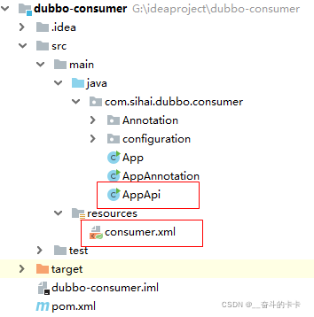

# Dubbo

---

* 1.1 Dubbo概述Dubbo是阿里巴巴开源的基于 Java 的高性能RPC（一种远程调用） 分布式服务框架，致力于提供高性能和透明化的RPC远程服务调用方案，以及SOA服务治理方案。每天为2千多个服务提供大于30亿次访问量支持，并被广泛应用于阿里巴巴集团的各成员站点以及别的公司的业务中。简单的说，Dubbo就是个服务框架，如果没有分布式的需求，其实是不需要用的，只有在分布式的时候，才有Dubbo这样的分布式服务框架的需求。并且本质上是个远程服务调用的分布式框架（告别Web Service模式中的
* 2022-11-16 23:03:38

---

## 1.1 `Dubbo`概述

 **`Dubbo`是阿里巴巴开源的基于 `Java` 的高性能`RPC`（一种远程调用） 分布式服务框架，致力于提供高性能和透明化的`RPC`远程服务调用方案，以及`SOA`服务治理方案** 。

每天为`2`千多个服务提供大于`30`亿次访问量支持，并被广泛应用于阿里巴巴集团的各成员站点以及别的公司的业务中。

简单的说，`Dubbo`就是个服务[框架](https://so.csdn.net/so/search?q=%E6%A1%86%E6%9E%B6&spm=1001.2101.3001.7020)，如果没有分布式的需求，其实是不需要用的，只有在分布式的时候，才有`Dubbo`这样的[分布式](https://so.csdn.net/so/search?q=%E5%88%86%E5%B8%83%E5%BC%8F&spm=1001.2101.3001.7020)服务框架的需求。

并且本质上是个远程服务调用的分布式框架（告别`Web Service`模式中的`WSdl`，以服务者与消费者的方式在`Dubbo`上注册）

其核心部分包含：

1、 **远程通讯** ：提供对多种基于长连接的`NIO`框架抽象封装，包括多种线程模型，序列化，以及“请求-响应”模式的信息交换方式。  
 2、 **集群容错** ：提供基于接口方法的透明远程过程调用，包括多协议支持，以及软负载均衡，失败容错，地址路由，动态配置等集群支持。  
 3、 **自动发现** ：基于注册中心目录服务，使服务消费方能动态的查找服务提供方，使地址透明，使服务提供方可以平滑增加或减少机器。

## 1.2 `Dubbo`背景

`Dubbo`开始于电商系统，因此在这里先从电商系统的演变讲起。

### 1.2.1 单一应用框架

  
 当网站流量很小时，只需一个应用，将所有功能如下单支付等都部署在一起，以减少部署节点和成本。

 **缺点** ：单一的系统架构，使得在开发过程中，占用的资源越来越多，而且随着流量的增加越来越难以维护。

### 1.2.2 垂直应用框架

  
 垂直应用架构解决了单一应用架构所面临的扩容问题，流量能够分散到各个子系统当中，且系统的体积可控，一定程度上降低了开发人员之间协同以及维护的成本，提升了开发效率。

 **缺点** ：但是在垂直架构中相同逻辑代码需要不断的复制，不能复用。

### 1.2.3 分布式应用架构(`RPC`)

  
 当垂直应用越来越多，应用之间交互不可避免，将核心业务抽取出来，作为独立的服务，逐渐形成稳定的服务中心。

### 1.2.4 流动计算架构(`SOA`)

随着服务化的进一步发展，服务越来越多，服务之间的调用和依赖关系也越来越复杂，诞生了面向服务的架构体系(`SOA`)，也因此衍生出了一系列相应的技术，如对服务提供、服务调用、连接处理、通信协议、序列化方式、服务发现、服务路由、日志输出等行为进行封装的服务框架。

### 1.2.5 架构演变详解

从以上是电商系统的演变可以看出架构演变的过程：  
   
 1、单应用单服务器；  
 2、单应用拆分成多个应用并部署到多个服务器；  
 3、单应用拆分成多个应用并实现分布式部署；  
 4、流动计算框架（用于提高机器利用率的资源调度和治理中心）

#### 1.2.5.1 单一应用架构

当网站流量很小时，只需一个应用，将所有功能都部署在一起，以减少部署节点和成本。 此时，用于简化增删改查工作量的 数据访问框架(`ORM`) 是关键。

#### 1.2.5.2 垂直应用架构

当访问量逐渐增大，单一应用增加机器带来的加速度越来越小，将应用拆成互不相干的几个应用，以提升效率。此时，用于加速前端页面开发的 `Web`框架(`MVC`) 是关键。

#### 1.2.5.3 分布式服务架构

当垂直应用越来越多，应用之间交互不可避免，将核心业务抽取出来，作为独立的服务，逐渐形成稳定的服务中心，使前端应用能更快速的响应多变的市场需求。此时，用于提高业务复用及整合的 分布式服务框架(`RPC`) 是关键。

#### 1.2.5.4 流动计算架构

当服务越来越多，容量的评估，小服务资源的浪费等问题逐渐显现，此时需增加一个调度中心基于访问压力实时管理集群容量，提高集群利用率。此时，用于提高机器利用率的 资源调度和治理中心(`SOA`) 是关键。

### 1.2.6 `RPC`的简介

**`RPC(Remote Procedure Call Protocol)`：远程过程调用**

两台服务器`A、B`，分别部署不同的应用`a,b`。当`A`服务器想要调用`B`服务器上应用`b`提供的函数或方法的时候，由于不在一个内存空间，不能直接调用，需要通过网络来表达调用的语义传达调用的数据。  
 说白了，就是你在你的机器上写了一个程序，我这边是无法直接调用的，这个时候就出现了一个远程服务调用的概念。

`RPC`是一种通过网络从远程计算机程序上请求服务，而不需要了解底层网络技术的协议。`RPC`协议假定某些传输协议的存在，如`TCP`或`UDP`，为通信程序之间携带信息数据。在`OSI`网络通信模型中，`RPC`跨越了传输层和应用层。`RPC`使得开发包括网络分布式多程序在内的应用程序更加容易。  
  **`RPC`采用客户机/服务器模式** 。请求程序就是一个客户机，而服务提供程序就是一个服务器。首先，客户机调用进程发送一个有进程参数的调用信息到服务进程，然后等待应答信息。在服务器端，进程保持睡眠状态直到调用信息到达为止。当一个调用信息到达，服务器获得进程参数，计算结果，发送答复信息，然后等待下一个调用信息，最后，客户端调用进程接收答复信息，获得进程结果，然后调用执行继续进行。

#### 1.2.6.1 `RPC`需要解决的问题

* **通讯问题** ：主要是通过在客户端和服务器之间建立TCP连接，远程过程调用的所有交换的数据都在这个连接里传输。连接可以是按需连接，调用结束后就断掉，也可以是长连接，多个远程过程调用共享同一个连接。
* **寻址问题** ：A服务器上的应用怎么告诉底层的RPC框架，如何连接到B服务器（如主机或`IP`地址）以及特定的端口，方法的名称名称是什么，这样才能完成调用。比如基于`Web`服务协议栈的`RPC`，就要提供一个`endpoint URI`，或者是从`UDDI`服务上查找。如果是`RMI`调用的话，还需要一个`RMI Registry`来注册服务的地址。
* **序列化 与 反序列化** ：当`A`服务器上的应用发起远程过程调用时，方法的参数需要通过底层的网络协议如`TCP`传递到`B`服务器，由于网络协议是基于二进制的，内存中的参数的值要序列化成二进制的形式，也就是序列化（`Serialize`）或编组（`marshal`），通过寻址和传输将序列化的二进制发送给`B`服务器。  
  同理，`B`服务器接收参数要将参数反序列化。B服务器应用调用自己的方法处理后返回的结果也要序列化给`A`服务器，`A`服务器接收也要经过反序列化的过程。

## 1.3 `Dubbo`作用

我们一起来看一下`Dubbo`的服务治理图：

​

### 1.3.1 为什么使用`Dubbo`

因为是阿里开源项目，国内很多互联网公司都在用，已经经过很多线上考验。内部使用了`Netty、Zookeeper`，保证了高性能高可用性。

* **使用`Dubbo`可以将核心业务抽取出来，作为独立的服务** ，逐渐形成稳定的服务中心，可用于提高业务复用灵活扩展，使前端应用能更快速的响应多变的市场需求。
* 分布式架构可以承受更大规模的并发流量。

### 1.3.2 `Dubbo`能做什么

1、 **透明化的远程方法调用** ，就像调用本地方法一样调用远程方法，只需简单配置，没有任何`API`侵入。  
 2、 **软负载均衡及容错机制** ，可在内网替代`F5`等硬件负载均衡器，降低成本，减少单点。  
 3.、 **服务自动注册与发现** ，不再需要写死服务提供方地址，注册中心基于接口名查询服务提供者的`IP`地址，并且能够平滑添加或删除服务提供者。

 **`Dubbo`采用全`Spring`配置方式，透明化接入应用，对应用没有任何`API`侵入，只需用`Spring`加载`Dubbo`的配置即可** ，`Dubbo`基于`Spring`的`Schema`扩展进行加载。

## 1.4 `Dubbo` 和 `Spring Cloud`区别

1、 **通信方式不同** ：`Dubbo` 使用的是 `RPC` 通信，而`Spring Cloud` 使用的是`HTTP RESTFul`方式。  
 2、 **组成不一样** ：

* `dubbo`的服务注册中心为`Zookeerper`，服务监控中心为`dubbo-monitor`，无消息总线、服务跟踪、批量任务等组件；
* `Spring Cloud`的服务注册中心为`spring-cloud netflix enruka`，服务监控中心为`spring-boot admin`，有消息总线、数据流、服务跟踪、批量任务等组件；

## 1.5 `Dubbo`技术架构

首先我们一起来看一下`Dubbo`官网提供的架构图：  
   
 **节点角色说明**

|节点|角色说明|
| -----------| ----------------------------------------|
|Provider|暴露服务的服务提供方|
|Consumer|调用远程服务的服务消费方|
|Registry|服务注册与发现的注册中心|
|Monitor|统计服务的调用次数和调用时间的监控中心|
|Container|服务运行容器|

看了这几个概念后似乎发现其实`Dubbo` 的架构也是很简单的(其实现细节是复杂)，为什么这么说呢，有没有发现，其实很像**生产者-消费者**模型。只是在这种模型上，加上了 **注册中心和监控中心** ，用于管理提供方提供的`url`，以及管理整个过程。

**调用关系说明**

1、服务容器负责启动，加载，运行服务提供者。  
 2、服务提供者在启动时，向注册中心注册自己提供的服务。  
 3、服务消费者在启动时，向注册中心订阅自己所需的服务。  
 4、注册中心返回服务提供者地址列表给消费者，如果有变更，注册中心将基于长连接推送变更数据给消费者。  
 5、服务消费者，从提供者地址列表中，基于软负载均衡算法，选一台提供者进行调用，如果调用失败，再选另一台调用。  
 6、服务消费者和提供者，在内存中累计调用次数和调用时间，定时每分钟发送一次统计数据到监控中心。

---

那么，整个**发布-订阅**的过程就非常的简单了：

* 启动容器，加载，运行服务提供者。
* 服务提供者在启动时，在注册中心发布注册自己提供的服务。
* 服务消费者在启动时，在注册中心订阅自己所需的服务。

如果考虑**失败或变更**的情况，就需要考虑下面的过程：

* 注册中心返回服务提供者地址列表给消费者，如果有变更，注册中心将基于长连接推送变更数据给消费者。
* 服务消费者，从提供者地址列表中，基于软负载均衡算法，选一台提供者进行调用，如果调用失败，再选另一台调用。
* 服务消费者和提供者，在内存中累计调用次数和调用时间，定时每分钟发送一次统计数据到监控中心。

## 1.6 `Dubbo`入门案例

### 1.6.1 服务端

首先，我们先把服务端的接口写好，因为其实`dubbo`的作用简单来说就是给消费端提供接口。

**接口定义**

```java
/**
 * xml方式服务提供者接口
 */
public interface ProviderService { 
    String SayHello(String word);
}
123456
```

这个接口非常简单，只是包含一个 `SayHello` 的方法。

接着，定义它的**实现类**

```java
/**
 * xml方式服务提供者实现类
 */
public class ProviderServiceImpl implements ProviderService{ 
    public String SayHello(String word) { 
        return word;
    }
}
12345678
```

这样我们就把我们的接口写好了，那么我们应该怎么将我们的服务暴露出去呢？

**导入 maven 依赖**

```xml
<?xml version="1.0" encoding="UTF-8"?>
<project xmlns="http://maven.apache.org/POM/4.0.0"
         xmlns:xsi="http://www.w3.org/2001/XMLSchema-instance"
         xsi:schemaLocation="http://maven.apache.org/POM/4.0.0 http://maven.apache.org/xsd/maven-4.0.0.xsd">
    <modelVersion>4.0.0</modelVersion>

    <groupId>com.ouyangsihai</groupId>
    <artifactId>dubbo-provider</artifactId>
    <version>1.0-SNAPSHOT</version>

    <dependencies>
        <dependency>
            <groupId>junit</groupId>
            <artifactId>junit</artifactId>
            <version>3.8.1</version>
            <scope>test</scope>
        </dependency>
        <!-- https://mvnrepository.com/artifact/com.alibaba/dubbo -->
        <dependency>
            <groupId>com.alibaba</groupId>
            <artifactId>dubbo</artifactId>
            <version>2.6.6</version>
        </dependency>
        <dependency>
            <groupId>org.apache.zookeeper</groupId>
            <artifactId>zookeeper</artifactId>
            <version>3.4.10</version>
        </dependency>
        <dependency>
            <groupId>com.101tec</groupId>
            <artifactId>zkclient</artifactId>
            <version>0.5</version>
        </dependency>
        <dependency>
            <groupId>io.netty</groupId>
            <artifactId>netty-all</artifactId>
            <version>4.1.32.Final</version>
        </dependency>
        <dependency>
            <groupId>org.apache.curator</groupId>
            <artifactId>curator-framework</artifactId>
            <version>2.8.0</version>
        </dependency>
        <dependency>
            <groupId>org.apache.curator</groupId>
            <artifactId>curator-recipes</artifactId>
            <version>2.8.0</version>
        </dependency>

    </dependencies>
</project>
123456789101112131415161718192021222324252627282930313233343536373839404142434445464748495051
```

这里使用的`dubbo`的版本是`2.6.6`，需要注意的是，如果你只导入`dubbo`的包的时候是会报错的，找不到`netty`和`curator`的依赖，所以，在这里我们需要把这两个的依赖加上，就不会报错了。

另外，这里我们使用 `zookeeper`作为注册中心。

到目前为止，`dubbo` 需要的环境就已经可以了，下面，我们就把上面刚刚定义的接口暴露出去。

**暴露接口（`xml` 配置方法）**  
 首先，我们在我们项目的`resource`目录下创建 `META-INF.spring` 包，然后再创建 `provider.xml` 文件，名字可以任取哦，如下图所示

​

```xml
<?xml version="1.0" encoding="UTF-8"?>
<beans xmlns="http://www.springframework.org/schema/beans"
       xmlns:xsi="http://www.w3.org/2001/XMLSchema-instance"
       xmlns:dubbo="http://code.alibabatech.com/schema/dubbo"
       xsi:schemaLocation="http://www.springframework.org/schema/beans        http://www.springframework.org/schema/beans/spring-beans.xsd        http://code.alibabatech.com/schema/dubbo        http://code.alibabatech.com/schema/dubbo/dubbo.xsd">

    <!--当前项目在整个分布式架构里面的唯一名称，计算依赖关系的标签-->
    <dubbo:application name="provider" owner="sihai">
        <dubbo:parameter key="qos.enable" value="true"/>
        <dubbo:parameter key="qos.accept.foreign.ip" value="false"/>
        <dubbo:parameter key="qos.port" value="55555"/>
    </dubbo:application>

    <dubbo:monitor protocol="registry"/>

    <!--dubbo这个服务所要暴露的服务地址所对应的注册中心-->
    <!--<dubbo:registry address="N/A"/>-->
    <dubbo:registry address="N/A" />

    <!--当前服务发布所依赖的协议；webservice、Thrift、Hessain、http-->
    <dubbo:protocol name="dubbo" port="20880"/>

    <!--服务发布的配置，需要暴露的服务接口-->
    <dubbo:service
            interface="com.sihai.dubbo.provider.service.ProviderService"
            ref="providerService"/>

    <!--Bean bean定义-->
    <bean id="providerService" class="com.sihai.dubbo.provider.service.ProviderServiceImpl"/>

</beans>
12345678910111213141516171819202122232425262728293031
```

说明：

1、上面的文件其实就是类似 `spring`的配置文件，而且，`dubbo` 底层就是 `spring`。  
 2、节点：`dubbo:application`  
 就是整个项目在分布式架构中的唯一名称，可以在`name`属性中配置，另外还可以配置`owner`字段，表示属于谁。  
 下面的参数是可以不配置的，这里配置是因为出现了端口的冲突，所以配置。  
 3、节点：`dubbo:monitor`  
 监控中心配置， 用于配置连接监控中心相关信息，可以不配置，不是必须的参数。  
 4、节点：`dubbo:registry`  
 配置注册中心的信息，比如，这里我们可以配置 `zookeeper` 作为我们的注册中心。`address` 是注册中心的地址，这里我们配置的是 `N/A` 表示由 `dubbo`自动分配地址。或者说是一种直连的方式，不通过注册中心。  
 5、节点：`dubbo:protocol`  
 服务发布的时候 `dubbo` 依赖什么协议，可以配置`dubbo`、`webservice`、`http`等协议。  
 6、节点：`dubbo:service`  
 这个节点就是我们的重点了，当我们服务发布的时候，我们就是通过这个配置将我们的服务发布出去的。`interface`是接口的包路径，`ref`是第 ⑦ 点配置的接口的`bean`。  
 7、最后，我们需要像配置`spring`的接口一样，配置接口的 `bean`。

到这一步，关于服务端的配置就完成了，下面我们通过 `main` 方法将接口发布出去。

**发布接口**

```java
package com.sihai.dubbo.provider;

import com.alibaba.dubbo.config.ApplicationConfig;
import com.alibaba.dubbo.config.ProtocolConfig;
import com.alibaba.dubbo.config.RegistryConfig;
import com.alibaba.dubbo.config.ServiceConfig;
import com.alibaba.dubbo.container.Main;
import com.sihai.dubbo.provider.service.ProviderService;
import com.sihai.dubbo.provider.service.ProviderServiceImpl;
import org.springframework.context.support.ClassPathXmlApplicationContext;

import java.io.IOException;

/**
 * xml方式启动
 *
 */
public class App 
{ 
    public static void main( String[] args ) throws IOException { 
        //加载xml配置文件启动
        ClassPathXmlApplicationContext context = new ClassPathXmlApplicationContext("META-INF/spring/provider.xml");
        context.start();
        System.in.read(); // 按任意键退出
    }
}
1234567891011121314151617181920212223242526
```

发布接口非常简单，因为`dubbo`底层就是依赖 `spring` 的，所以，我们只需要通过 `ClassPathXmlApplicationContext`拿到我们刚刚配置好的 `xml`，然后调用 `context.start()`方法就启动了。

看到下面的截图，就算是启动成功了，接口也就发布出去了。

  
 你以为到这里就结束了了，并不是的，我们拿到 `dubbo` 暴露出去的 `url`分析分析。

**Dubbo 暴露的 URL**

```
dubbo://192.168.234.1:20880/com.sihai.dubbo.provider.service.ProviderService?anyhost=true&application=provider&bean.name=com.sihai.dubbo.provider.service.ProviderService&bind.ip=192.168.234.1&bind.port=20880&dubbo=2.0.2&generic=false&interface=com.sihai.dubbo.provider.service.ProviderService&methods=SayHello&owner=sihai&pid=8412&qos.accept.foreign.ip=false&qos.enable=true&qos.port=55555&side=provider&timestamp=1562077289380
1
```

分析如下：

1、首先，在形式上我们发现，其实这么牛逼的 `dubbo`也是用类似于 `http` 的协议发布自己的服务的，只是这里我们用的是`dubbo`协议。  
 2、`dubbo://192.168.234.1:20880/com.sihai.dubbo.provider.service.ProviderService`  
 上面这段链接就是 `?`之前的链接，构成： **协议://ip:端口/接口** 。发现是不是也没有什么神秘的。  
 3、`anyhost=true&application=provider&bean.name=com.sihai.dubbo.provider.service.ProviderService&bind.ip=192.168.234.1&bind.port=20880&dubbo=2.0.2&generic=false&interface=com.sihai.dubbo.provider.service.ProviderService&methods=SayHello&owner=sihai&pid=8412&qos.accept.foreign.ip=false&qos.enable=true&qos.port=55555&side=provider&timestamp=1562077289380`  
 `?`之后的字符串，分析后你发现，这些都是刚刚在`provider.xml`中配置的字段，然后通过`&` 拼接而成的，闻到了 `http` 的香味了吗？

终于，`dubbo` 服务端入门了。下面我们看看拿到了 `url`后，怎么消费呢？

### 1.6.2 消费端

上面提到，我们在服务端提供的只是点对点的方式提供服务，并没有使用注册中心，所以，下面的配置也是会有一些不一样的。

**消费端环境配置**  
 首先，我们在消费端的 `resource`下建立配置文件 `consumer.xml`

​

```xml
<?xml version="1.0" encoding="UTF-8"?>
<beans xmlns="http://www.springframework.org/schema/beans"
       xmlns:xsi="http://www.w3.org/2001/XMLSchema-instance"
       xmlns:dubbo="http://code.alibabatech.com/schema/dubbo"
       xsi:schemaLocation="http://www.springframework.org/schema/beans        http://www.springframework.org/schema/beans/spring-beans.xsd        http://code.alibabatech.com/schema/dubbo        http://code.alibabatech.com/schema/dubbo/dubbo.xsd">

    <!--当前项目在整个分布式架构里面的唯一名称，计算依赖关系的标签-->
    <dubbo:application name="consumer" owner="sihai"/>

    <!--dubbo这个服务所要暴露的服务地址所对应的注册中心-->
    <!--点对点的方式-->
    <dubbo:registry address="N/A" />
    <!--<dubbo:registry address="zookeeper://localhost:2181" check="false"/>-->

    <!--生成一个远程服务的调用代理-->
    <!--点对点方式-->
    <dubbo:reference id="providerService"
interface="com.sihai.dubbo.provider.service.ProviderService"
url="dubbo://192.168.234.1:20880/com.sihai.dubbo.provider.service.ProviderService"/>

    <!--<dubbo:reference id="providerService"  
                    interface="com.sihai.dubbo.provider.service.ProviderService"/>-->
</beans>
1234567891011121314151617181920212223
```

分析如下所示：

1、发现这里的 `dubbo:application` 和 `dubbo:registry` 是一致的  
 2、`dubbo:reference` ：我们这里采用点对点的方式，所以，需要配置在服务端暴露的 `url`

**maven 依赖**  
 和服务端一样

```xml
<?xml version="1.0" encoding="UTF-8"?>
<project xmlns="http://maven.apache.org/POM/4.0.0"
         xmlns:xsi="http://www.w3.org/2001/XMLSchema-instance"
         xsi:schemaLocation="http://maven.apache.org/POM/4.0.0 http://maven.apache.org/xsd/maven-4.0.0.xsd">
    <modelVersion>4.0.0</modelVersion>

    <groupId>com.ouyangsihai</groupId>
    <artifactId>dubbo-consumer</artifactId>
    <version>1.0-SNAPSHOT</version>

    <dependencies>
        <dependency>
            <groupId>com.ouyangsihai</groupId>
            <artifactId>dubbo-provider</artifactId>
            <version>1.0-SNAPSHOT</version>
        </dependency>
        <dependency>
            <groupId>junit</groupId>
            <artifactId>junit</artifactId>
            <version>3.8.1</version>
            <scope>test</scope>
        </dependency>
        <!-- https://mvnrepository.com/artifact/com.alibaba/dubbo -->
        <dependency>
            <groupId>com.alibaba</groupId>
            <artifactId>dubbo</artifactId>
            <version>2.6.6</version>
        </dependency>
        <dependency>
            <groupId>org.apache.zookeeper</groupId>
            <artifactId>zookeeper</artifactId>
            <version>3.4.10</version>
        </dependency>
        <dependency>
            <groupId>com.101tec</groupId>
            <artifactId>zkclient</artifactId>
            <version>0.5</version>
        </dependency>
        <dependency>
            <groupId>io.netty</groupId>
            <artifactId>netty-all</artifactId>
            <version>4.1.32.Final</version>
        </dependency>
        <dependency>
            <groupId>org.apache.curator</groupId>
            <artifactId>curator-framework</artifactId>
            <version>2.8.0</version>
        </dependency>
        <dependency>
            <groupId>org.apache.curator</groupId>
            <artifactId>curator-recipes</artifactId>
            <version>2.8.0</version>
        </dependency>
    </dependencies>
</project>
12345678910111213141516171819202122232425262728293031323334353637383940414243444546474849505152535455
```

**调用服务**

```java
package com.sihai.dubbo.consumer;

import com.alibaba.dubbo.config.ApplicationConfig;
import com.alibaba.dubbo.config.ReferenceConfig;
import com.alibaba.dubbo.config.RegistryConfig;
import com.sihai.dubbo.provider.service.ProviderService;
import org.springframework.context.support.ClassPathXmlApplicationContext;

import java.io.IOException;

/**
 * xml的方式调用
 *
 */
public class App 
{ 
    public static void main( String[] args ) throws IOException { 

        ClassPathXmlApplicationContext context=new ClassPathXmlApplicationContext("consumer.xml");
        context.start();
        ProviderService providerService = (ProviderService) context.getBean("providerService");
        String str = providerService.SayHello("hello");
        System.out.println(str);
        System.in.read();

    }
}
123456789101112131415161718192021222324252627
```

这里和服务端的发布如出一辙  
   
 如此，我们就成功调用接口了。

## 1.7 加入`zookeeper`作为注册中心

在前面的案例中，我们没有使用任何的注册中心，而是用一种直连的方式进行的。但是，实际上很多时候，我们都是使用`dubbo + zookeeper`的方式，使用 `zookeeper` 作为注册中心，这里，我们就介绍一下 `zookeeper`作为注册中心的使用方法。

这里，我们在前面的入门实例中进行改造。

### 1.7.1 服务端

在服务端中，我们只需要修改`provider.xml` 即可。

```xml
<?xml version="1.0" encoding="UTF-8"?>
<beans xmlns="http://www.springframework.org/schema/beans"
       xmlns:xsi="http://www.w3.org/2001/XMLSchema-instance"
       xmlns:dubbo="http://code.alibabatech.com/schema/dubbo"
       xsi:schemaLocation="http://www.springframework.org/schema/beans        http://www.springframework.org/schema/beans/spring-beans.xsd        http://code.alibabatech.com/schema/dubbo        http://code.alibabatech.com/schema/dubbo/dubbo.xsd">

    <!--当前项目在整个分布式架构里面的唯一名称，计算依赖关系的标签-->
    <dubbo:application name="provider" owner="sihai">
        <dubbo:parameter key="qos.enable" value="true"/>
        <dubbo:parameter key="qos.accept.foreign.ip" value="false"/>
        <dubbo:parameter key="qos.port" value="55555"/>
    </dubbo:application>

    <dubbo:monitor protocol="registry"/>

    <!--dubbo这个服务所要暴露的服务地址所对应的注册中心-->
    <!--<dubbo:registry address="N/A"/>-->
    <dubbo:registry address="zookeeper://localhost:2181" check="false"/>

    <!--当前服务发布所依赖的协议；webservice、Thrift、Hessain、http-->
    <dubbo:protocol name="dubbo" port="20880"/>

    <!--服务发布的配置，需要暴露的服务接口-->
    <dubbo:service
            interface="com.sihai.dubbo.provider.service.ProviderService"
            ref="providerService"/>

    <!--Bean bean定义-->
    <bean id="providerService" class="com.sihai.dubbo.provider.service.ProviderServiceImpl"/>

</beans>
12345678910111213141516171819202122232425262728293031
```

重点关注这句话

```
<dubbo:registry address="zookeeper://localhost:2181" />
1
```

在 `address` 中，使用我们的 `zookeeper` 的地址。

如果是`zookeeper`集群的话，使用下面的方式。

```
<dubbo:registry protocol="zookeeper" address="192.168.11.129:2181,192.168.11.137:2181,192.168.11.138:2181"/>
1
```

服务端的配置就好了，其他的跟 入门案例 一样。

### 1.7.2 消费端

跟服务端一样，在消费端，我们也只需要修改 `consumer.xml` 即可。

```xml
<?xml version="1.0" encoding="UTF-8"?>
<beans xmlns="http://www.springframework.org/schema/beans"
       xmlns:xsi="http://www.w3.org/2001/XMLSchema-instance"
       xmlns:dubbo="http://code.alibabatech.com/schema/dubbo"
       xsi:schemaLocation="http://www.springframework.org/schema/beans        http://www.springframework.org/schema/beans/spring-beans.xsd        http://code.alibabatech.com/schema/dubbo        http://code.alibabatech.com/schema/dubbo/dubbo.xsd">

    <!--当前项目在整个分布式架构里面的唯一名称，计算依赖关系的标签-->
    <dubbo:application name="consumer" owner="sihai"/>

    <!--dubbo这个服务所要暴露的服务地址所对应的注册中心-->
    <!--点对点的方式-->
    <!--<dubbo:registry address="N/A" />-->
    <dubbo:registry address="zookeeper://localhost:2181" check="false"/>

    <!--生成一个远程服务的调用代理-->
    <!--点对点方式-->
    <!--<dubbo:reference id="providerService"
                     interface="com.sihai.dubbo.provider.service.ProviderService"
                     url="dubbo://192.168.234.1:20880/com.sihai.dubbo.provider.service.ProviderService"/>-->

    <dubbo:reference id="providerService"
                     interface="com.sihai.dubbo.provider.service.ProviderService"/>

</beans>
123456789101112131415161718192021222324
```

1、注册中心配置跟服务端一样

```
<dubbo:registry address="zookeeper://localhost:2181"/>
1
```

2、`dubbo:reference`  
 由于我们这里使用 `zookeeper` 作为注册中心，所以，跟点对点的方式是不一样的，这里不再需要 `dubbo` 服务端提供的 url 了，只需要直接引用服务端提供的接口即可

```
<dubbo:reference id="providerService"
                     interface="com.sihai.dubbo.provider.service.ProviderService"/>
12
```

好了，消费端也配置好了，这样就可以使用修改的入门案例，重新启动运行了。

  
 同样成功了。

这时候的区别在于， **将 `dubbo` 发布的`url`注册到了 `zookeeper`，消费端从 `zookeeper`消费，`zookeeper` 相当于一个中介，给消费者提供服务** 。

你以为这就完了？不，好戏才刚刚开始呢。

## 1.8 多种配置方式

在入门实例的时候，我们使用的是 `xml` 配置的方式，对 `dubbo` 的环境进行了配置，但是，官方还提供了其他的配置方式，这里我们也一一分解。

### 1.8.1 `API`配置方式

这种方式其实官方是不太推荐的，官方推荐使用`xml`配置的方式，但是，在有的时候测试的时候，还是可以用的到的，另外，为了保证完整性，这些内容还是有必要讲讲的。

首先还是回到服务端工程。

**服务端**  
   
 这里我们使用 `api`的方式配置，所以，`provider.xml`这个配置文件就暂时不需要了，我们只需要在上面的 `AppApi` 这个类中的 `main`方法中用`api`配置及启动即可。

```java
package com.sihai.dubbo.provider;

import com.alibaba.dubbo.config.ApplicationConfig;
import com.alibaba.dubbo.config.ProtocolConfig;
import com.alibaba.dubbo.config.RegistryConfig;
import com.alibaba.dubbo.config.ServiceConfig;
import com.sihai.dubbo.provider.service.ProviderService;
import com.sihai.dubbo.provider.service.ProviderServiceImpl;

import java.io.IOException;

/**
 * Api方式启动
 * api的方式调用不需要其他的配置，只需要下面的代码即可。
 * 但是需要注意，官方建议：
 * Api方式用于测试用例使用，推荐xml的方式
 */
public class AppApi
{ 
    public static void main( String[] args ) throws IOException { 

        // 服务实现
        ProviderService providerService = new ProviderServiceImpl();

        // 当前应用配置
        ApplicationConfig application = new ApplicationConfig();
        application.setName("provider");
        application.setOwner("sihai");

        // 连接注册中心配置
        RegistryConfig registry = new RegistryConfig();
        registry.setAddress("zookeeper://localhost:2181");
//        registry.setUsername("aaa");
//        registry.setPassword("bbb");

        // 服务提供者协议配置
        ProtocolConfig protocol = new ProtocolConfig();
        protocol.setName("dubbo");
        protocol.setPort(20880);
        //protocol.setThreads(200);

        // 注意：ServiceConfig为重对象，内部封装了与注册中心的连接，
        //以及开启服务端口

        // 服务提供者暴露服务配置
        // 此实例很重，封装了与注册中心的连接，请自行缓存，
        //否则可能造成内存和连接泄漏
        ServiceConfig<ProviderService> service = new ServiceConfig<ProviderService>(); 
        service.setApplication(application);
        // 多个注册中心可以用setRegistries()
        service.setRegistry(registry); 
        // 多个协议可以用setProtocols()
        service.setProtocol(protocol); 
        service.setInterface(ProviderService.class);
        service.setRef(providerService);
        service.setVersion("1.0.0");

        // 暴露及注册服务
        service.export();
    }
}
12345678910111213141516171819202122232425262728293031323334353637383940414243444546474849505152535455565758596061
```

分析说明如下所示：

看到上面的代码是不是云里雾里，不要慌，我们通过对照 `xml`的方式分析一下。

**registry 的 xml方式**

```
<dubbo:registry protocol="zookeeper" address="localhost:2181"/>
1
```

**API 的方式**

```java
RegistryConfig registry = new RegistryConfig();
registry.setAddress("zookeeper://localhost:2181");
12
```

`dubbo:registry`节点对应`RegistryConfig` ，`xml`的属性对应 `API`方式用 `set`方法就可以了。对比之下，你就会发现，如果 `API`的方式不熟悉，可以对照`xml` 配置方式就可以。

**其他 API**

```
org.apache.dubbo.config.ServiceConfig
org.apache.dubbo.config.ReferenceConfig
org.apache.dubbo.config.ProtocolConfig
org.apache.dubbo.config.RegistryConfig
org.apache.dubbo.config.MonitorConfig
org.apache.dubbo.config.ApplicationConfig
org.apache.dubbo.config.ModuleConfig
org.apache.dubbo.config.ProviderConfig
org.apache.dubbo.config.ConsumerConfig
org.apache.dubbo.config.MethodConfig
org.apache.dubbo.config.ArgumentConfig
1234567891011
```

更详细的可以查看官方文档：

> http://[dubbo](https://so.csdn.net/so/search?q=dubbo&spm=1001.2101.3001.7020).apache.org/zh-cn…
>

我们再看看我配置的消费端的`Api`方式。

**消费端**  
 同样，我们不需要 `consumer.xml` 配置文件了，只需要在 `main`方法中启动即可。

​

```java
package com.sihai.dubbo.consumer;

import com.alibaba.dubbo.config.ApplicationConfig;
import com.alibaba.dubbo.config.ReferenceConfig;
import com.alibaba.dubbo.config.RegistryConfig;
import com.sihai.dubbo.provider.service.ProviderService;

/**
 * api的方式调用
 * api的方式调用不需要其他的配置，只需要下面的代码即可。
 * 但是需要注意，官方建议：
 * Api方式用于测试用例使用，推荐xml的方式
 */
public class AppApi { 

    public static void main(String[] args) { 
        // 当前应用配置
        ApplicationConfig application = new ApplicationConfig();
        application.setName("consumer");
        application.setOwner("sihai");

        // 连接注册中心配置
        RegistryConfig registry = new RegistryConfig();
        registry.setAddress("zookeeper://localhost:2181");

        // 注意：ReferenceConfig为重对象，内部封装了与注册中心的连接，
        //以及与服务提供方的连接

        // 引用远程服务
        ReferenceConfig<ProviderService> reference = new ReferenceConfig<ProviderService>(); // 此实例很重，封装了与注册中心的连接以及与提供者的连接，请自行缓存，否则可能造成内存和连接泄漏
        reference.setApplication(application);
        reference.setRegistry(registry); // 多个注册中心可以用setRegistries()
        reference.setInterface(ProviderService.class);

        // 和本地bean一样使用xxxService
        ProviderService providerService = reference.get(); // 注意：此代理对象内部封装了所有通讯细节，对象较重，请缓存复用
        providerService.SayHello("hello dubbo! I am sihai!");
    }
}
123456789101112131415161718192021222324252627282930313233343536373839
```

这部分的 `API`配置的方式就到这了，注意：官方推荐 `xml` 的配置方法

### 1.8.2 注解配置方式

注解配置方式还是需要了解一下的，现在微服务都倾向于这种方式，这也是以后发展的趋势，`0` 配置应该是这几年的趋势。

那么如何对`dubbo` 使用注解的方式呢？我们先看服务端。

**服务端**  
   
 **第一步：定义接口及实现类，在上面的截图中的 `annotation` 包下**

```java
package com.sihai.dubbo.provider.service.annotation;

/**
 * 注解方式接口
 */
public interface ProviderServiceAnnotation { 
    String SayHelloAnnotation(String word);
}
12345678
```

---

```java
package com.sihai.dubbo.provider.service.annotation;

import com.alibaba.dubbo.config.annotation.Service;

/**
 * 注解方式实现类
 */
@Service(timeout = 5000)
public class ProviderServiceImplAnnotation implements ProviderServiceAnnotation{ 

    public String SayHelloAnnotation(String word) { 
        return word;
    }
}
1234567891011121314
```

**@Service**

`@Service` 用来配置 `Dubbo` 的服务提供方。

 **第二步：组装服务提供方** 。通过 `Spring` 中 `Java Config` 的技术（`@Configuration`）和 `annotation` 扫描（`@EnableDubbo`）来发现、组装、并向外提供`Dubbo`的服务。

```java
package com.sihai.dubbo.provider.configuration;

import com.alibaba.dubbo.config.ApplicationConfig;
import com.alibaba.dubbo.config.ProtocolConfig;
import com.alibaba.dubbo.config.ProviderConfig;
import com.alibaba.dubbo.config.RegistryConfig;
import com.alibaba.dubbo.config.spring.context.annotation.EnableDubbo;
import org.springframework.context.annotation.Bean;
import org.springframework.context.annotation.Configuration;

/**
 * 注解方式配置
 */
@Configuration
@EnableDubbo(scanBasePackages = "com.sihai.dubbo.provider.service.annotation")
public class DubboConfiguration { 

    @Bean // #1 服务提供者信息配置
    public ProviderConfig providerConfig() { 
        ProviderConfig providerConfig = new ProviderConfig();
        providerConfig.setTimeout(1000);
        return providerConfig;
    }

    @Bean // #2 分布式应用信息配置
    public ApplicationConfig applicationConfig() { 
        ApplicationConfig applicationConfig = new ApplicationConfig();
        applicationConfig.setName("dubbo-annotation-provider");
        return applicationConfig;
    }

    @Bean // #3 注册中心信息配置
    public RegistryConfig registryConfig() { 
        RegistryConfig registryConfig = new RegistryConfig();
        registryConfig.setProtocol("zookeeper");
        registryConfig.setAddress("localhost");
        registryConfig.setPort(2181);
        return registryConfig;
    }

    @Bean // #4 使用协议配置，这里使用 dubbo
    public ProtocolConfig protocolConfig() { 
        ProtocolConfig protocolConfig = new ProtocolConfig();
        protocolConfig.setName("dubbo");
        protocolConfig.setPort(20880);
        return protocolConfig;
    }
}
123456789101112131415161718192021222324252627282930313233343536373839404142434445464748
```

分析说明如下：  
 1、通过 `@EnableDubbo`指定在`com.sihai.dubbo.provider.service.annotation`下扫描所有标注有 `@Service` 的类

2、通过 `@Configuration`将 `DubboConfiguration`中所有的 `@Bean`通过`Java Config`的方式组装出来并注入给 `Dubbo`服务，也就是标注有`@Service` 的类。

这其中就包括了：

```
ProviderConfig：服务提供方配置
ApplicationConfig：应用配置
RegistryConfig：注册中心配置
ProtocolConfig：协议配置
1234
```

看起来很复杂，其实。。。  
   
 **第三步：启动服务**

```java
package com.sihai.dubbo.provider;

import com.alibaba.dubbo.config.spring.context.annotation.DubboComponentScan;
import com.sihai.dubbo.provider.configuration.DubboConfiguration;
import org.springframework.context.annotation.AnnotationConfigApplicationContext;
import sun.applet.Main;

import java.io.IOException;

/**
 * 注解启动方式
 */
public class AppAnnotation { 

    public static void main(String[] args) throws IOException { 
        AnnotationConfigApplicationContext context = new AnnotationConfigApplicationContext(DubboConfiguration.class); 
        context.start();
        System.in.read(); 
    }
}
1234567891011121314151617181920
```

发现输出下面信息就表示 `success`了

  
 **消费端**

同样我们下看看消费端的工程，有一个感性认识。

  
 **第一步：引用服务**

```java
package com.sihai.dubbo.consumer.Annotation;

import com.alibaba.dubbo.config.annotation.Reference;
import com.sihai.dubbo.provider.service.annotation.ProviderServiceAnnotation;
import org.springframework.stereotype.Component;

/**
 * 注解方式的service
 */
@Component("annotatedConsumer")
public class ConsumerAnnotationService { 

    @Reference
    private ProviderServiceAnnotation providerServiceAnnotation;

    public String doSayHello(String name) { 
        return providerServiceAnnotation.SayHelloAnnotation(name);
    }
}
12345678910111213141516171819
```

在 `ConsumerAnnotationService` 类中，通过 `@Reference` 引用服务端提供的类，然后通过方法调用这个类的方式，给消费端提供接口。

注意：如果这里找不到 `ProviderServiceAnnotation` 类，请在服务端先把服务端工程用 `Maven intall`一下，然后将服务端的依赖放到消费端的`pom` 中。如下：

```
<dependency>
          <groupId>com.ouyangsihai</groupId>
            <artifactId>dubbo-provider</artifactId>
            <version>1.0-SNAPSHOT</version>
</dependency>
12345
```

解释一下：引入的`jar`包里面只是未被实现的接口，`rpc`需要在客户端服务端定义一套统一的接口，然后在服务端实现接口，实际上还是网络通信，只不过长得像本地实现

**第二步：组装服务消费者**

这一步和服务端是类似的，这里就不在重复了。

```java
package com.sihai.dubbo.consumer.configuration;

import com.alibaba.dubbo.config.ApplicationConfig;
import com.alibaba.dubbo.config.ConsumerConfig;
import com.alibaba.dubbo.config.RegistryConfig;
import com.alibaba.dubbo.config.spring.context.annotation.EnableDubbo;
import org.springframework.context.annotation.Bean;
import org.springframework.context.annotation.ComponentScan;
import org.springframework.context.annotation.Configuration;

import java.util.HashMap;
import java.util.Map;

/**
 * 注解配置类
 */
@Configuration
@EnableDubbo(scanBasePackages = "com.sihai.dubbo.consumer.Annotation")
@ComponentScan(value = { "com.sihai.dubbo.consumer.Annotation"})
public class ConsumerConfiguration { 
    @Bean // 应用配置
    public ApplicationConfig applicationConfig() { 
        ApplicationConfig applicationConfig = new ApplicationConfig();
        applicationConfig.setName("dubbo-annotation-consumer");
        Map<String, String> stringStringMap = new HashMap<String, String>();
        stringStringMap.put("qos.enable","true");
        stringStringMap.put("qos.accept.foreign.ip","false");
        stringStringMap.put("qos.port","33333");
        applicationConfig.setParameters(stringStringMap);
        return applicationConfig;
    }

    @Bean // 服务消费者配置
    public ConsumerConfig consumerConfig() { 
        ConsumerConfig consumerConfig = new ConsumerConfig();
        consumerConfig.setTimeout(3000);
        return consumerConfig;
    }

    @Bean // 配置注册中心
    public RegistryConfig registryConfig() { 
        RegistryConfig registryConfig = new RegistryConfig();
        registryConfig.setProtocol("zookeeper");
        registryConfig.setAddress("localhost");
        registryConfig.setPort(2181);
        return registryConfig;
    }
}
123456789101112131415161718192021222324252627282930313233343536373839404142434445464748
```

**第三步：发起远程调用**

在`main`方法中通过启动一个`Spring Context`，从其中查找到组装好的`Dubbo`的服务消费者，并发起一次[远程调用](https://so.csdn.net/so/search?q=%E8%BF%9C%E7%A8%8B%E8%B0%83%E7%94%A8&spm=1001.2101.3001.7020)。

```java
package com.sihai.dubbo.consumer;

import com.sihai.dubbo.consumer.Annotation.ConsumerAnnotationService;
import com.sihai.dubbo.consumer.configuration.ConsumerConfiguration;
import com.sihai.dubbo.provider.service.ProviderService;
import org.springframework.context.annotation.AnnotationConfigApplicationContext;
import org.springframework.context.support.ClassPathXmlApplicationContext;

import java.io.IOException;

/**
 * 注解方式启动
 *
 */
public class AppAnnotation
{ 
    public static void main( String[] args ) throws IOException { 

        AnnotationConfigApplicationContext context = new AnnotationConfigApplicationContext(ConsumerConfiguration.class); 
        context.start(); // 启动
        ConsumerAnnotationService consumerAnnotationService = context.getBean(ConsumerAnnotationService.class); 
        String hello = consumerAnnotationService.doSayHello("annotation"); // 调用方法
        System.out.println("result: " + hello); // 输出结果

    }
}
1234567891011121314151617181920212223242526
```

结果如下所示：

​

## 1.9 常用场景

在下面的讲解中，都会是以`xml`配置的方式来讲解的，这也是`dubbo`官方比较推荐的方式。以下的操作都是在服务端的 `xml` 配置文件和消费端的配置文件来讲解的。

### 1.9.1 启动时检查

`Dubbo` 缺省会在启动时检查依赖的服务是否可用，不可用时会抛出异常，阻止 `Spring`初始化完成，以便上线时，能及早发现问题，默认`check="true"`。

但是，有的时候，我们并不是都需要启动时就检查的，比如测试的时候，我们是需要更快速的启动，所以，这种场景的时候，我们是需要关闭这个功能的。

下面，我们看看如何使用这个功能。

在服务端注册的时候（客户端注册时同样适用）；

```xml
<dubbo:registry protocol="zookeeper" address="localhost:2181,localhost:2182,localhost:2183" check="false"/>
1
```

在客户端引用服务端服务的时候；

```xml
<dubbo:reference check="false" id="providerService"
                     interface="com.sihai.dubbo.provider.service.ProviderService"/>
12
```

就是这么简单，就是这么强！

### 1.9.2 集群容错

`dubbo` 也是支持集群容错的，同时也有很多可选的方案，其中，默认的方案是 `failover`，也就是重试机制。

首先，我们先把所有的容错机制都整理一遍，然后再看看使用。

|集群模式|说明|使用方法|
| -----------------------| ---------------------------------------------------------------------------------------------------------------------------------------| -----------------------------------------------------------------|
|`Failover Cluster`|失败自动切换，当出现失败，重试其它服务器。通常用于读操作，但重试会带来更长延迟。可通过`retries="2"`来设置重试次数(不含第一次)。|`cluster="xxx"`xxx：集群模式名称 ，例如`cluster="failover"`|
|`Failfast Cluster`|快速失败，只发起一次调用，失败立即报错。通常用于非幂等性的写操作，比如新增记录。||
|`Failsafe Cluster`|失败安全，出现异常时，直接忽略。||
|`Failback Cluster`|失败自动恢复，后台记录失败请求，定时重发。通常用于消息通知操作。||
|`Forking Cluster`|并行调用多个服务器，只要一个成功即返回。通常用于实时性要求较高的读操作，但需要浪费更多服务资源。可通过`forks="2"`来设置最大并行数。||
|`Broadcast Cluster`|广播调用所有提供者，逐个调用，任意一台报错则报错。通常用于通知所有提供者更新缓存或日志等本地资源信息。||

**使用实例**  
 在发布服务或者引用服务的时候设置

```xml
<!--服务发布的配置，需要暴露的服务接口-->
    <dubbo:service cluster="failover" retries="2"
            interface="com.sihai.dubbo.provider.service.ProviderService"
            ref="providerService"/>
1234
```

---

```xml
<dubbo:reference cluster="failover" retries="2" check="false" id="providerService"
                     interface="com.sihai.dubbo.provider.service.ProviderService"/>
12
```

### 1.9.3 负载均衡

负载均衡想必是一个再熟悉不过的概念了，所以，`dubbo` 支持也是再正常不过了，这里也总结一下`dubbo`支持的负载均衡的一些方案及使用方法。

|负载均衡模式|说明|使用方法|
| --------------------------------| -------------------------------------------------------------------------------------------------------------------------------------------------| ---------------------------------------------------------|
|`Random LoadBalance`|随机 按权重设置随机概率|`<dubbo:service loadbalance="xxx"/>`xxx：负载均衡方法|
|`RoundRobin LoadBalance`|轮询 按公约后的权重设置轮询比率。||
|`LeastActive LoadBalance`|最少活跃调用数 相同活跃数的随机，活跃数指调用前后计数差。||
|`ConsistentHash LoadBalance`|一致性`Hash`相同参数的请求总是发到同一提供者。 当某一台提供者挂时，原本发往该提供者的请求，基于虚拟节点，平摊到其它提供者，不会引起剧烈变动。||

### 1.9.4 直连提供者

在开发及测试环境下，经常需要绕过注册中心，只测试指定服务提供者，所以，这种情况下，我们只需要直接连接服务端的地即可，其实，这种方法在前面的讲解已经使用到了，第一种讲解的方式就是这种方式，因为这种方式简单。

使用方法如下所示：

```xml
<dubbo:reference id="providerService"
                     interface="com.sihai.dubbo.provider.service.ProviderService"
                     url="dubbo://192.168.234.1:20880/com.sihai.dubbo.provider.service.ProviderService"/>
123
```

说明：可以看到，只要在消费端在·`dubbo:reference` 节点使用`url`给出服务端的方法即可。

### 1.9.5 只订阅

只订阅就是只能够订阅服务端的服务，而不能够注册。

引用官方的使用场景如下：

> 为方便开发测试，经常会在线下共用一个所有服务可用的注册中心，这时，如果一个正在开发中的服务提供者注册，可能会影响消费者不能正常运行。  
> 可以让服务提供者开发方，只订阅服务(开发的服务可能依赖其它服务)，而不注册正在开发的服务，通过直连测试正在开发的服务。
>

```xml
<dubbo:registry register="false" protocol="zookeeper" address="localhost:2181,localhost:2182,localhost:2183" check="false"/>
1
```

1、使用只订阅方式  
 当在服务提供端使用 `register="false"` 的时候，我们使用下面的方式获取服务端的服务；

```xml
<dubbo:reference cluster="failover" retries="2" check="false" id="providerService"
                     interface="com.sihai.dubbo.provider.service.ProviderService"/>
12
```

启动信息

  
 发现，这时候并不是向注册中心 `zookeeper` 注册，而只是做了发布服务和启动`netty`。

2、不使用只订阅方式

```java
<dubbo:registry protocol="zookeeper" address="localhost:2181,localhost:2182,localhost:2183" check="false"/>
1
```

启动信息

  
 可以发现，这里就向注册中心 `zookeeper` 注册了。

### 1.9.6 只注册

只注册正好跟前面的只订阅相反，这个时候可以向注册中心注册，但是，消费端却不能够读到服务。

**应用场景**

> 如果有两个镜像环境，两个注册中心，有一个服务只在其中一个注册中心有部署，另一个注册中心还没来得及部署，而两个注册中心的其它应用都需要依赖此服务。这个时候，可以让服务提供者方只注册服务到另一注册中心，而不从另一注册中心订阅服务。
>

**使用说明**

```xml
<dubbo:registry subscribe="false" address="localhost:2181"></dubbo:registry>
1
```

在服务端的 `dubbo:registry` 节点下使用 `subscribe="false"` 来声明这个服务是只注册的服务。

这个时候消费端调用的时候是不能调用的。

​

### 1.9.7 多协议机制

在前面我们使用的协议都是 `dubbo` 协议，但是 `dubbo`除了支持这种协议外还支持其他的协议，比如，`rmi、hessian`等，另外，而且还可以用多种协议同时暴露一种服务。

**使用方法**

**1、一种接口使用一种协议**

先声明多种协议

```xml
 <!--当前服务发布所依赖的协议；webserovice、Thrift、Hessain、http-->
    <dubbo:protocol name="dubbo" port="20880"/>
    <dubbo:protocol name="rmi" port="1099" />
123
```

然后在发布接口的时候使用具体协议

```xml
<!--服务发布的配置，需要暴露的服务接口-->
    <dubbo:service cluster="failover" retries="2"
            interface="com.sihai.dubbo.provider.service.ProviderService"
            ref="providerService"/>
    <dubbo:service cluster="failover" retries="2"
                   interface="com.sihai.dubbo.provider.service.ProviderService"
                   ref="providerService" protocol="rmi"/>
1234567
```

在输出日志中，就可以找到`rmi`发布的接口。

```
rmi://192.168.234.1:1099/com.sihai.dubbo.provider.service.ProviderService?anyhost=true&application=provider&bean.name=com.sihai.dubbo.provider.service.ProviderService&cluster=failover&dubbo=2.0.2&generic=false&interface=com.sihai.dubbo.provider.service.ProviderService&methods=SayHello&owner=sihai&pid=796&retries=2&side=provider&timestamp=1564281053185, dubbo version: 2.6.6, current host: 192.168.234.1
1
```

**2、一种接口使用多种协议**  
 声明协议和上面的方式一样，在发布接口的时候有一点不一样。

```xml
<dubbo:service cluster="failover" retries="2"
                   interface="com.sihai.dubbo.provider.service.ProviderService"
                   ref="providerService" protocol="rmi,dubbo"/>
123
```

说明：`protocol`属性，可以用`,`隔开，使用多种协议。

### 1.9.8 多注册中心

`Dubbo`支持同一服务向多注册中心同时注册，或者不同服务分别注册到不同的注册中心上去，甚至可以同时引用注册在不同注册中心上的同名服务。

**服务端多注册中心发布服务**

一个服务可以在不同的注册中心注册，当一个注册中心出现问题时，可以用其他的注册中心。

**注册**

```xml
<!--多注册中心-->
    <dubbo:registry protocol="zookeeper" id="reg1" timeout="10000" address="localhost:2181"/>
    <dubbo:registry protocol="zookeeper" id="reg2" timeout="10000" address="localhost:2182"/>
    <dubbo:registry protocol="zookeeper" id="reg3" timeout="10000" address="localhost:2183"/>
1234
```

**发布服务**

```xml
<!--服务发布的配置，需要暴露的服务接口-->
    <dubbo:service cluster="failover" retries="2"
            interface="com.sihai.dubbo.provider.service.ProviderService"
            ref="providerService" registry="reg1"/>
    <dubbo:service cluster="failover" retries="2"
                   interface="com.sihai.dubbo.provider.service.ProviderService"
                   ref="providerService" protocol="rmi" registry="reg2"/>
1234567
```

说明：使用`registry="reg2"`指定该接口使用的注册中心，同时也可以使用多个`，`用，隔开，例如，`registry="reg1,,reg2"`。

**消费端多注册中心引用服务**

首先，先向不同注册中心注册;

```xml
<!--多注册中心-->
    <dubbo:registry protocol="zookeeper" id="reg1" timeout="10000" address="localhost:2181"/>
    <dubbo:registry protocol="zookeeper" id="reg2" timeout="10000" address="localhost:2182"/>
    <dubbo:registry protocol="zookeeper" id="reg3" timeout="10000" address="localhost:2183"/>
1234
```

其次，不同的消费端服务引用使用不同的注册中心；

```xml
<!--不同的服务使用不同的注册中心-->
    <dubbo:reference cluster="failover" retries="2" check="false" id="providerService"
                     interface="com.sihai.dubbo.provider.service.ProviderService" registry="reg1"/>
    <dubbo:reference cluster="failover" retries="2" check="false" id="providerService2"
                     interface="com.sihai.dubbo.provider.service.ProviderService" registry="reg2"/>
12345
```

说明：上面分别使用注册中心`1`和注册中心`2`。

### 1.9.9 多版本

不同的服务是有版本不同的，版本可以更新并且升级，同时，不同的版本之间是不可以调用的。

```xml
<!--服务发布的配置，需要暴露的服务接口-->
    <dubbo:service cluster="failover" retries="2"
            interface="com.sihai.dubbo.provider.service.ProviderService"
            ref="providerService" registry="reg1" version="1.0.0"/>
    <dubbo:service cluster="failover" retries="2"
                   interface="com.sihai.dubbo.provider.service.ProviderService"
                   ref="providerService" protocol="rmi" registry="reg2" version="1.0.0"/>
1234567
```

加入了版本控制。

### 1.9.10 日志管理

`dubbo`也可以将日志信息记录或者保存到文件中的。

1、使用`accesslog`输出到`log4j`

```xml
<dubbo:protocol accesslog="true" name="dubbo" port="20880"/>
    <dubbo:protocol accesslog="true" name="rmi" port="1099" />
12
```

2、输出到文件

```xml
<dubbo:protocol accesslog="http://localhost/log.txt" name="dubbo" port="20880"/>
    <dubbo:protocol accesslog="http://localhost/log2.txt" name="rmi" port="1099" />
12
```
